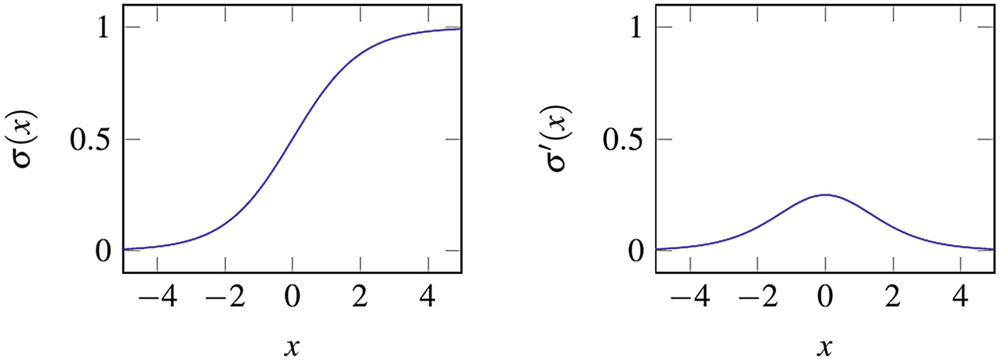
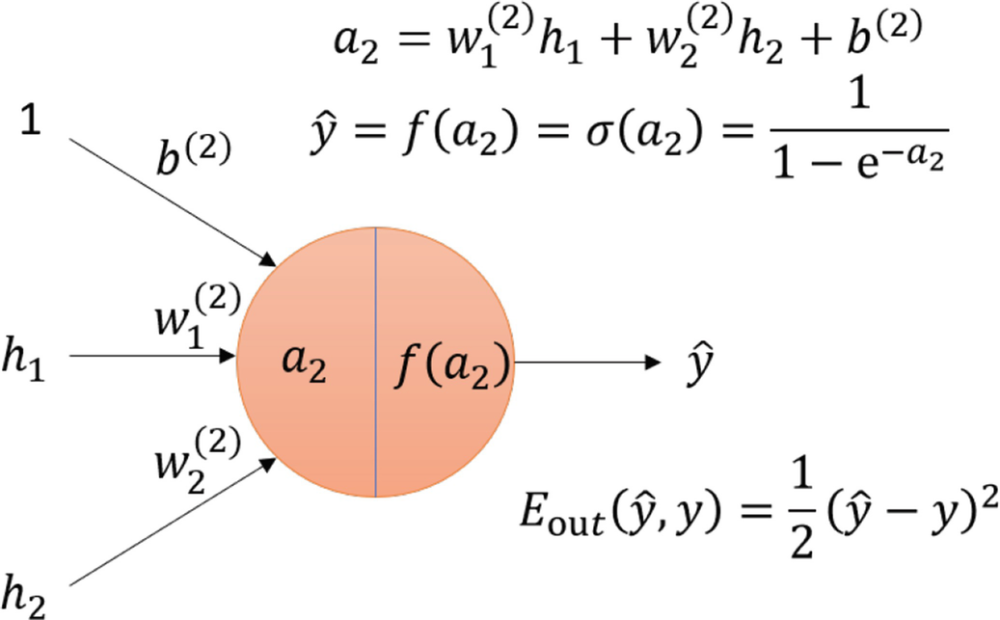
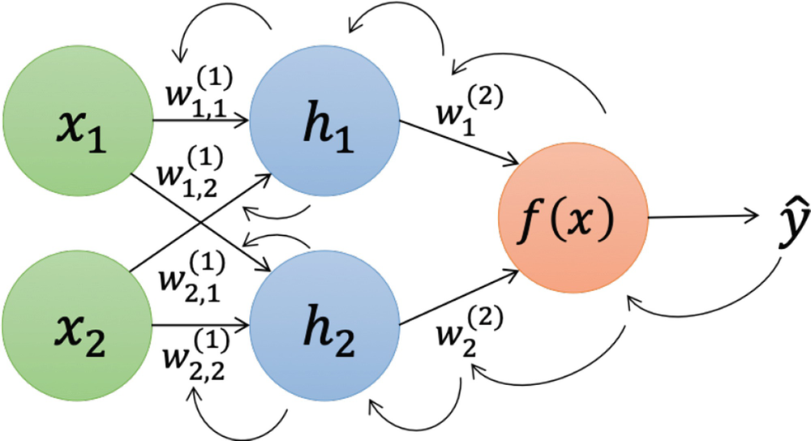
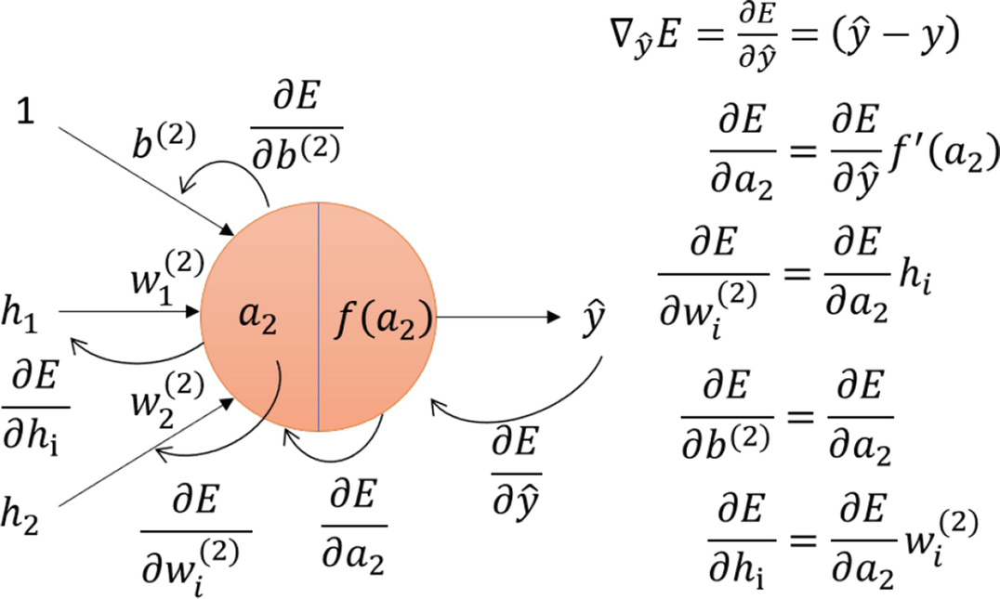

# 关于考核
智科院目前综测政策认为智能基座全校分享会属于长期活动，可加综测文体分；社团干事可加综测德育分（算为职务分），近日综测制定有修改，以最终版加分办法为主。从此次分享会开始，组内成员累计无故缺勤累计超过4次将不被视为干事并不予颁发干事聘书，活动部与创艺部的组内成员只需遵循自己部门考核规定。

# 码界杯
对算法感兴趣的同学可关注智能基座与智科院举办的算法比赛“码界杯”，不论智科院内外同学都可参加，拿奖与综测加分细则待社长与老师商讨。

虽然培训会已经开完，但未来得及参加或还需复习的同学可[点击此处](https://mdg-papergroup-1382022823.cos.ap-guangzhou.myqcloud.com/_%E7%A0%81%E7%95%8C%E6%9D%AF%E5%9F%B9%E8%AE%AD.pptx)进行下载。码界杯题目可能涉及一些未接触过的概念，推荐大一新生提前从ppt了解。

# 文献/论文阅读
做为论文复现组的成员，我们当然要学会如何阅读一篇文献，如果以后我们进入了课题组，跟老师做项目，或成为了研究生，这也是不可缺少的一项技能。

大多数文献都是英文形式的，但这不代表我们需要像做阅读理解一样阅读它们，可以大概遵循这样的阅读思路：
1. 引言（introduction）可看可不看，主要是介绍项目背景，帮助你理解为什么要写此论文
2. 先详细读摘要（abstract），这是整个文章的概览
3. 中间的文章是作者/团队的科研心路历程（通常人工智能领域内的大部分论文都是这样），我们可以把它当成一个故事，只需要大概理解即可，重点理解作者这个思路为什么好，有什么优点
4. 中间部分优先看图表/算法/伪代码，这是作者思路的精华可视化，有时“一图胜千言”
5. 实验与结果快速浏览，通常这部分用于“吹牛逼”，和别人的成果比一比谁更厉害，可以看看他们用了哪些指标来验证他们的方法，可以帮助你客观评估他们的成果可信度与适用范围
6. 结论（conclusion）顾名思义就是文章的总结，基本上就是它们的科研成果有什么作用/意义/进步的省流概括版，这个也要读一下，帮助你巩固文字价值和意义的理解
> 这是部长自己阅读论文的思路，怎么去读一篇论文没有规定的标准，只要能够理解论文的方法就是好方法，此处仅供大家参考

读论文我们推荐几种阅读方式，这个已经在分享会上详细说过，此处简单带过
1. 浏览器下载豆包插件，在pdf浏览页面会有“AI阅读”按钮，可以快速通过AI的总结理解论文大概，该插件自带论文翻译功能
2. 使用[知云文献翻译](https://www.zhiyunwenxian.cn/)，哪里看不懂选中哪里即可翻译
3. 这种方式没什么人推荐，只是部长个人用下来比较好用且顺心，这不是广告，确实需要收费，但是免费版限额也够我们一天阅读1-2篇文献，自带全文翻译和论文重排版，支持AI逐句问答，同学可自行前往[官网](https://www.scholaread.cn/landing/translation)了解详细

# 我们接下来的任务
我们已经在本次分享学会了深度学习的四大训练流程——前向、损失、反向、更新。我们已经了解了人工智能是怎么通过已知的数据预测未知的数据，接下来我们需要学习人工智能如何“看见世界”。我们已经介绍过，深度学习主流神经网络有MLP、CNN、RNN、Transfomer，各种网络应用于什么场景我们已经在分享会说过，此处不再一一赘述，感兴趣的同学可以自己搜索资料了解。

那么我们想要计算机“看见”世界，就需要用到卷积神经网络（CNN），CNN的概念已经在我们之前布置的阅读鱼书的任务提到过，对概念不熟悉的同学可私下自行补回之前的任务。卷积神经网络有几篇很著名的论文，我们打算让大家通过VGG这篇论文入门卷积神经网络，所以我们**本次的任务就是阅读VGG这一篇论文**，论文可在本网站资源栏目中的"Very Deep Convolutional Networks for Large-Scale Image Recognition"下载。看完论文的同学可以**写一份简单的阅读报告**，无需遵循规范格式，大概阐述你学到了什么东西、VGG的核心思想是什么，不一定要长篇大论，只需意思传达到位即可，报告上传至[论文复现组提交处](https://f.wps.cn/g/ep5IgqHt/)，上传代号003。

> 当然，实现计算机视觉的方法不一定只有CNN，还有vision transfomer等方式，但CNN算是比较早兴起的计算机视觉技术，我们以CNN做为我们学习计算机视觉的出发点

# 神经网络是如何学习的？——MLP的训练流程

你可能听说过人工智能、深度学习这些酷炫的词，而它们背后最核心的“大脑”之一就是神经网络。今天，我们就以一个最经典的网络——多层感知机（MLP）为例，一起揭开它学习和训练过程。

别担心，我们会用最通俗的比喻和最少的数学公式，带你走完一遍完整的训练流程。

你可以查看我们[原版笔记内容](markdown-viewer.html?file=MLP_detailed_explanation)，但是为了方便大家的理解，我们特意以通俗的角度重新描述了一次深度学习的训练流程，希望能够让同学更清晰地学习。下面我们正式开始内容的讲解：

想象一下，我们有一个“机器”，我们想教它一项新技能，比如根据**房间大小**和**离市中心的距离**来预测**房价**。这个“机器”就是我们的神经网络。

训练它的过程分为四个关键步骤：

> **训练“机器”的四步法：**
>
> 1. **猜一下（前向传播）**：给它一个房子的数据，让它根据现有知识猜一个房价。
> 2. **对答案（误差计算）**：我们告诉它正确答案，看看它猜的有多离谱。
> 3. **找原因（反向传播）**：分析这次猜错的原因，弄清楚是哪个环节的判断出了问题，以及问题的严重程度。
> 4. **调整思路（参数更新）**：根据分析结果，调整内部的判断标准，争取下次猜得更准。

接下来，我们就一步步拆解这四个过程。

---

### 1. 猜一下 (前向传播)

“前向传播”听起来很专业，但它的本质就是**让数据从输入端流向输出端，得到一个预测结果**的过程。

我们的“机器”内部是由一层层的“神经元”组成的。你可以把每个神经元想象成一个小的决策单元。

- **输入层**：接收最原始的数据。在我们的例子里，就是 `房间大小`和 `离市中心距离`。
- **隐藏层**：处理输入数据，提取更复杂的特征。比如，它可能会根据输入自己领悟出一个“性价比”的概念，我们把这里“领悟到到的概念”称为学习到的特征。这是我们看不见的，所以叫“隐藏层”。
- **输出层**：给出最终的预测结果。在我们的例子里，就是 `预测的房价`。

数据在这些层之间流动时，会经过两种计算：

1. **加权求和**：每个从上一层传来的数据，都会被乘上一个**权重（Weight）**。权重代表了这个信息的重要性。比如，“房间大小”的权重可能比“离市中心距离”高，因为它对房价影响更大。除了权重，还有一个**偏置（Bias）**，你可以理解为一个基础分，用来微调结果。

   `输出 = (输入1 × 权重1) + (输入2 × 权重2) + ... + 偏置`
2. **激活函数**：加权求和的结果会通过一个叫做**激活函数**的东西。它的作用是给网络加入“非线性”能力，让它能学习更复杂的关系。如果不用激活函数，那神经网络就跟简单的线性回归没区别了。

   最常用的激活函数之一是 **Sigmoid 函数**，它能把任何输入的数值都“压”到 0 和 1 之间，就像一个平滑的开关。

   $$
   \sigma(x) = \frac{1}{1 + e^{-x}}
   $$

   

**总结一下前向传播的过程：**

数据 `x`（房间信息）进入网络，先和第一层的权重矩阵 `W1` 相乘，加上偏置 `b1`，再通过激活函数 `f` 得到第一层的输出 `h1`。然后 `h1` 作为输入，重复这个过程，最终得到预测结果 `ŷ`（预测的房价）。

$$
\begin{aligned}
h_1 &= f(W_1 x + \mathbf{b_1}{}) \\
\hat{y} &= f(W_2 h_1 + b_2)
\end{aligned}
$$

现在，“机器”给出了它的第一个猜测 `ŷ`。

---

### 2. 对答案 (误差计算)

猜完之后，总得知道对不对，差多少吧？这一步就是**计算预测值 `ŷ` 和真实值 `y` 之间的差距**（我们默认这里是对回归线问题进行的训练）。这个差距，我们用一个叫做损失函数（Loss Function）的东西来衡量。

我们使用 **均方误差（MSE）** 做为本例中使用的损失函数，它的计算方法很简单：

$$
E(\hat{y}, y) = \frac{1}{2n} \sum_{i=1}^{n} (\hat{y}_i - y_i)^2
$$

其中n为需要计算损失的样本数，我们现在只关注简化后的单样本预测损失函数：

$$
E(\hat{y}, y) = \frac{1}{2} (\hat{y} - y)^2
$$

这个公式的意思是：

1. 计算预测值和真实值的差 `(ŷ - y)`。
2. 对这个差值进行平方，这样无论是猜高了还是猜低了，得到的都是一个正数。平方还能放大差距，让“错得离谱”的预测受到更严厉的“惩罚”。
3. 前面的 `1/2` 是为了后面计算方便（对E求导时可抵消系数），暂时不用管它。

损失值 `E` 就像一个“评分”，`E` 越大，说明“机器”这次猜得越差。我们的目标，就是通过训练，让这个 `E` 变得尽可能小。

下图形象地展示了数据流到输出层，并与真实值比较计算出误差的过程。



当然，常见的损失函数还包括：

- **总平方误差 (Sum of Squared Error, SSE)**

  - **适用场景**：回归任务。
  - **作用**：衡量连续型预测值与真实值的误差。
  - **公式**：
    $$
    \text{SSE} = \frac{1}{2} \sum_{i=1}^{m} (y_i - \hat{y}_i)^2
    $$

    其中，m 是样本数量，y_i 是真实值，y_hat 是预测值。系数 1/2 是为了求导方便。
- **交叉熵损失 (Cross-Entropy Loss, CEL)**

  - **适用场景**：分类任务。
  - **核心思想**：衡量两个概率分布之间的差异。在机器学习中，即衡量模型预测的概率分布与真实的标签分布之间的差异。
  - **(1) 二分类交叉熵**

    - **场景**：适用于只有两个类别（如是/否，猫/狗）的分类问题。
    - **公式**：
      $$
      \text{CEL} = - \left[ y \log p + (1 - y) \log(1 - p) \right]
      $$

      > 其中，\( y \) 是真实标签（0或1），\( p \) 是模型预测为类别1的概率。
      >
  - **(2) 多分类交叉熵**

    - **场景**：适用于有多个类别（如数字0-9识别）的分类问题。
    - **公式**：
      $$
      \text{CEL} = - \sum_{i=1}^{k} y_i \log p_i
      $$

      > 其中，\( k \) 是类别总数，\( y_i \) 是一个 one-hot 编码的向量（真实类别对应的位置是1，其他是0），\( p_i \) 是模型预测为第 \( i \) 个类别的概率。
      >

---

### 3. 找原因 (反向传播)

这是最关键也最神奇的一步！我们知道了“错得有多离谱”（损失值 `E`），现在就要**找出是谁导致了这个错误，以及各自应该负多大的责任**。这个过程就是“反向传播”。

它就像一个复盘会议：从最终的输出结果开始，一层一层地往回追溯，计算每个权重 `W` 和偏置 `b` 对最终的误差 `E` 贡献了多少“责任”。

这个“责任”在数学上叫做**梯度（Gradient）**。梯度是一个包含了所有参数损失函数偏导数的向量，它指向了能让损失值 `E` **增长最快**的方向。换句话说，如果我们想让 `E` **减小最快**，就应该朝着梯度的**相反方向**去调整参数。

计算梯度用到了微积分中的**链式法则**。如果你刚入门深度学习，暂时可以不深入理解它的数学推导，只需要记住它的思想：**一层一层地将误差的“责任”向前传递**。这里我们根据上图举个例子，计算W2导致的误差程度计算公式如下

$$
\frac{\partial E}{\partial W_2} = \frac{\partial E}{\partial \hat{y}} \cdot \frac{\partial \hat{y}}{\partial W_2}
$$

这个公式可以这样理解：“权重 `W2` 对最终误差 `E` 的影响”等于“预测值 `ŷ` 对误差 `E` 的影响”乘以“权重 `W2` 对预测值 `ŷ` 的影响”。

通过这种方式，我们可以计算出网络中**每一个**参数（`W1`, `b1`, `W2`, `b2`...）的梯度，也就是它们各自需要为最终的错误负的“责任”。



我们首先计算与预测相关的输出层的梯度：

$$
\nabla_y E(\hat{y}, y) = \frac{\partial E}{\partial \hat{y}} = (\hat{y} - y)
$$

然后我们可以计算关于第二层参数的误差：
我们目前有"激活后"梯度，所以我们需要计算激活前梯度：（使用逐元素乘法计算梯度与激活函数导数的积）

$$
\begin{aligned}
\nabla_{\mathbf{a}_{2}} E=\frac{\partial E}{\partial\mathbf{a}_{2}} &=\frac{\partial E}{\partial\hat{y}}\cdot\frac{\partial\hat{y}}{\partial\mathbf{a}_{2}}\\
& =\frac{\partial E}{\partial\hat{y}}\odot f^{\prime}\left(\mathbf{W}_{2}\mathbf{h}_{1}+\mathbf{b}_{2}\right)
\end{aligned}
$$

then, 计算关于 $\mathbf{W}_2$ 和 $\mathbf{b_2}$ 的误差：

$$
\begin{aligned}
\nabla_{\mathbf{W}_{2}} E = \frac{\partial E}{\partial\mathbf{W}_{2}} &= \frac{\partial E}{\partial\hat{y}}\cdot\frac{\partial\hat{y}}{\partial\mathbf{a}_{2}}\cdot\frac{\partial\mathbf{a}_{2}}{\partial\mathbf{W}_{2}} \\
&= \frac{\partial E}{\partial\mathbf{a}_{2}}\mathbf{h}_{1}^{\top}
\end{aligned}
$$

$$
\begin{aligned}
\nabla_{\mathbf{b}_{2}} E=\frac{\partial E}{\partial\mathbf{b}_{\mathbf{2}}} &=\frac{\partial E}{\partial\hat{y}}\cdot\frac{\partial\hat{y}}{\partial\mathbf{a}_{2}}\cdot\frac{\partial\mathbf{a}_{2}}{\partial\mathbf{b}_{2}}\\
& =\frac{\partial E}{\partial\mathbf{a}_{\mathbf{2}}}
\end{aligned}
$$

我们还可以计算关于第2层的输入（第1层的激活后输出）的误差：

$$
\begin{aligned}
\nabla_{\mathbf{h}_{1}} E=\frac{\partial E}{\partial\mathbf{h}_{\mathbf{1}}} &=\frac{\partial E}{\partial\hat{y}}\cdot\frac{\partial\hat{y}}{\partial\mathbf{a}_{2}}\cdot\frac{\partial\mathbf{a}_{2}}{\partial\mathbf{h}_{1}}\\
& =\mathbf{W}_{2}^{\top}\frac{\partial E}{\partial\mathbf{a}_{2}}
\end{aligned}
$$

然后，我们重复这个过程来计算误差关于第1层的参数 $\mathbf{W}_1$ 和 $b_1$ 的梯度，从而将误差向后传播到整个网络。



---

### 4. 调整思路 (参数更新)

复盘结束，责任也明确了。最后一步就是**根据“责任”大小来调整每个参数**，以便下次做得更好。这个过程叫做**参数更新**。

我们使用一种叫做随机梯度下降（SGD）的方法来更新参数。公式如下：

$$
\theta_{新} = \theta_{旧} - \alpha \cdot \nabla_{\theta} E
$$

让我们把它翻译成大白话：

- `θ`：代表网络中的任何一个参数，比如 `W1` 或 `b2`。
- `∇θE`：就是我们上一步算出来的梯度（参数 `θ` 对误差 `E` 的“责任”）。
- `α`：叫做**学习率（Learning Rate）**，它控制着每次调整的“步子”迈多大。
  - 如果 `α` **太大**，可能会一步迈过头，导致总是在最优解附近来回“震荡”，不稳定。
  - 如果 `α` **太小**，调整得太慢，训练过程会非常耗时。

所以，参数更新的本质就是：**沿着梯度的反方向，迈出一小步，来修正参数。**

完成这四步，我们就完成了一次训练。然后，我们拿出下一个房子的数据，重复“猜一下 → 对答案 → 找原因 → 调整思路”这个循环。成千上万次之后，“机器”内部的参数就会被调整到一个比较理想的状态，它就“学会”了如何预测房价！

---

## 深入了解：梯度下降的几种方式

上面我们提到了梯度下降，它就像是“下山”的过程，目标是找到山谷的最低点（损失函数的最小值）。但下山的方式不止一种。

我们的目标是找到最小化训练误差 `E_train` 的权重 `w`。

#### 批量梯度下降 (Batch Gradient Descent)

这是最稳妥的方式。它会**看完整个训练数据集（所有的房子数据）**，计算出所有数据产生的总误差，然后根据这个总误差的平均梯度，只更新一次参数。

- **优点**：方向非常准，因为它考虑了所有数据，能稳稳地走向最低点。
- **缺点**：当数据集非常大时（比如几百万张图片），计算一次梯度要耗费大量时间和内存。

```python
import numpy as np

def gradient_descent(X, y, learning_rate, n_iterations):
    """
    使用梯度下降训练模型。

    参数:
    X (np.array): 特征矩阵
    y (np.array): 目标向量
    learning_rate (float): 学习率
    n_iterations (int): 迭代次数

    返回:
    np.array: 训练好的权重向量
    """
    # 为每个样本添加偏置项 x0 = 1
    X_b = np.c_[np.ones((X.shape[0], 1)), X]
    n_samples = X.shape[0]
  
    # 随机初始化权重
    weights = np.random.randn(X_b.shape[1])
  
    for _ in range(n_iterations):
        # 计算预测值
        predictions = X_b.dot(weights)
        # 计算误差
        errors = predictions - y
        # 计算整个数据集的梯度
        gradients = (1/n_samples) * X_b.T.dot(errors)
        # 更新权重
        weights = weights - learning_rate * gradients
  
    return weights
```

#### 随机梯度下降 (Stochastic Gradient Descent, SGD)

这是最“心急”的方式。它**每看一个数据点**，就立刻计算梯度并更新一次参数。

- **优点**：更新速度快，训练过程快。它的随机性有时还能帮助“跳出”一些不好的局部最低点。
- **缺点**：因为每次只看一个样本，所以更新方向很不稳定，会在最低点附近“抖动”，难以精确收敛。

```python
import numpy as np

def stochastic_gradient_descent(X, y, learning_rate, n_epochs):
    """
    使用随机梯度下降训练模型。

    参数:
    X (np.array): 特征矩阵
    y (np.array): 目标向量
    learning_rate (float): 学习率
    n_epochs (int): 遍历数据集的次数

    返回:
    np.array: 训练好的权重向量
    """
    # 为每个样本添加偏置项 x0 = 1
    X_b = np.c_[np.ones((X.shape[0], 1)), X]
    n_samples = X.shape[0]
  
    # 随机初始化权重
    weights = np.random.randn(X_b.shape[1])
  
    for epoch in range(n_epochs):
        for i in range(n_samples):
            # 随机选择一个数据点
            random_index = np.random.randint(n_samples)
            xi = X_b[random_index:random_index+1]
            yi = y[random_index:random_index+1]
  
            # 计算预测值
            prediction = xi.dot(weights)
            # 计算误差
            error = prediction - yi
            # 计算单个数据点的梯度
            gradient = xi.T.dot(error)
            # 更新权重
            weights = weights - learning_rate * gradient
  
    return weights
```

#### 小批量梯度下降 (Mini-batch Gradient Descent)

这是上述两种方法的折中，也是现在最主流的方式。它把数据分成若干个**小批量（mini-batch）**，比如每次看 32 或 64 个数据，计算这个小批量的平均梯度，然后更新一次参数。

- **优点**：既保证了训练速度，又使得更新方向相对稳定，是效率和效果的完美平衡。
- **缺点**：需要额外设定一个超参数 `batch_size`（批次大小）。
