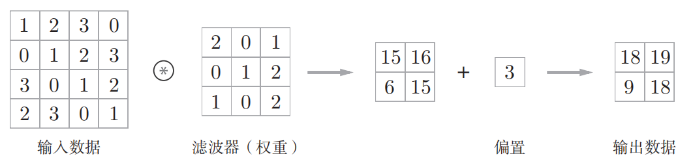
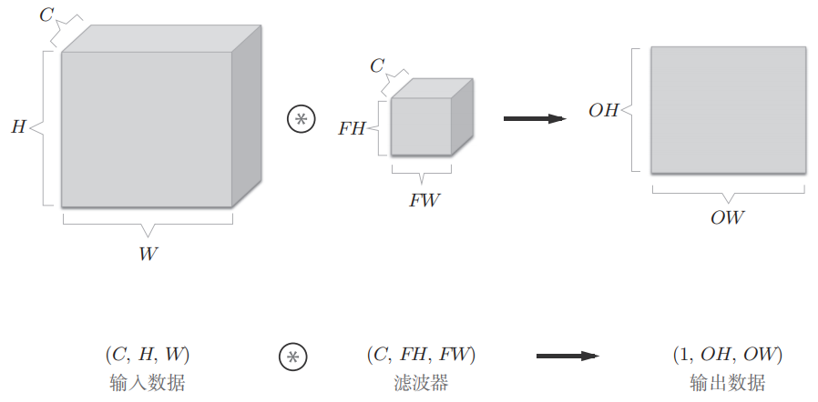
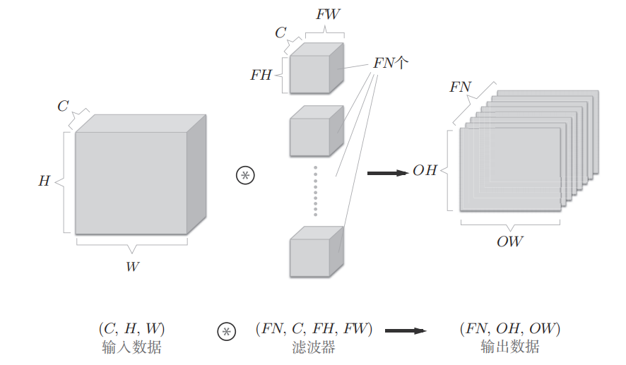
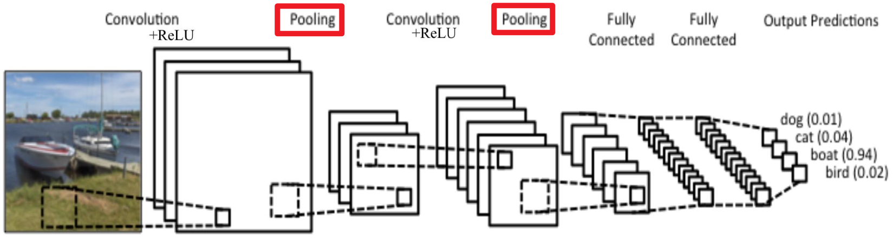

# 关于线下课与码界杯

我们后续会摊宣公开课与码界杯，同学可以来我们的摊位凑一下热闹~
智能基座2025年的第一次公开课将在11.29开课，公开课将分为三门课：python、c语言、ModelArts，参与者同样可给文体活动加相应综测分，感兴趣的同学可以了解一下~

# 我们接下来的任务

由于为期两周体测（11.15、11.16、11.22、11.23），技术部会对应地暂停两周的分享会活动，所以同学有充足的时间吸收我们之前讲过的知识，并完成之前未完成的任务。

- 未看完鱼书的同学可回看[论文复现组第一次分享会回顾](https://papergroup.tech/markdown-viewer.html?file=2nd_metting)布置的任务，对应地完成
- 还未写VGG论文阅读报告的同学可回看[第二次分享会回顾](https://papergroup.tech/markdown-viewer.html?file=3rd_metting)布置的任务，对应地完成

我们本次的任务是通过MNIST手写数字数据集来自己写一个数据读取/预处理脚本，并自己搭建一个CNN来完成对数据的训练与预测，我们在这里几点要求：

- 自定义模型类，继承自nn.Module，实现__init__()和forward()方法
- 使用自己写的脚本处理后的数据作为模型输入
- 建议把预处理脚本及模型代码分为两个.py文件

  [MNIST数据集下载](https://mdg-papergroup-1382022823.cos.ap-guangzhou.myqcloud.com/MNIST.zip)

- 提交至[论文复现提交处](https://f.wps.cn/g/ep5IgqHt/)，上传代号备注004

**什么是数据读取/预处理？**

神经网络只能接受**数值张量**作为输入，但原始数据集通常是图片文件、文本文件等格式。数据读取/预处理就是把这些原始数据转换为神经网络可以"理解"的形式：

1. **数据读取**：

   - 从文件（如 `.png`、`.jpg`、`.csv`）中加载数据
   - MNIST 数据集通常存储为图片文件或特定的二进制格式
   - 需要编写代码将这些文件读入内存
2. **数据预处理**：

   - **格式转换**：将图片转换为张量（如 `28×28×1` 的数组）
   - **归一化**：将像素值从 `[0, 255]` 缩放到 `[0, 1]` 或 `[-1, 1]`
     - 为什么要归一化？让数据在合理范围内，加速训练收敛
   - **标签处理**：将标签（如 "5"）转换为数字或 one-hot 编码
   - **批量组织**：将多个样本组织成 batch（如 `64×28×28×1`）

**示例**：MNIST 手写数字 "5" 的处理流程

```
原始数据: 5.png (28×28像素的灰度图)
    ↓ 读取
numpy数组: shape=(28, 28), 像素值范围 [0, 255]
    ↓ 归一化
张量: shape=(28, 28, 1), 值范围 [0, 1]
    ↓ 批量组织
输入张量: shape=(64, 28, 28, 1)  ← 神经网络可接受的输入
标签: [5, 3, 1, ..., 9] (长度64)
```

通过编写数据预处理脚本，你将学会如何"喂养"神经网络——这是深度学习工程中最基础也最重要的技能之一。

> 学习能力是论文复现组成员不可缺少的能力，大家可以多上网查资料，不懂的也可以问问ai，或者和部长来讨论，借鉴他人的思路代码并不可耻，核心是要把借鉴的东西内化为自己的认知，这也是一个进步的过程~

# 从核心概念到“看见”世界

## 神经网络相关概念补充

### 1. 向量、矩阵、张量

* **向量**：我们在中学都学过标量与向量，标量就是一个数字，向量带有空间的方向，使用列表可表示为[x,y]或[x,y,x]
* **矩阵**：我们有一个向量来表示房子的特征：[距离市中心距离, 房间大小]，如果想要表示多个房子的特征该怎么做呢？我们需要用到一种数据形式来储存多个房子信息的向量，这种数据形式就是矩阵，假设有四个房子的信息，我们可以这样表示：

  ```plaintext
  X = [
    [1.2,  85],   # 房子1: 距离市中心1.2公里, 面积85平米
    [3.4,  120],  # 房子2: 距离市中心3.4公里, 面积120平米
    [0.8,  65],   # 房子3: 距离市中心0.8公里, 面积65平米
    [2.5,  110]   # 房子4: 距离市中心2.5公里, 面积110平米
  ]
  ```

  实际上我们可以把n维向量视为一个1*n（一行n列）的矩阵，矩阵的概念完全可以由向量推广，那么矩阵运算和向量运算是否存在相似性呢？答案是肯定的，矩阵的加法与乘法完全与向量加法与乘法规则一致，我们接下来仅科普矩阵乘法，向量运算与矩阵运算的详细相似性同学可自行探索。
* **前置概念-转置**：转置的本质是交换张量中两个维度的顺序，这听起来非常难以理解，但幸运的是我们现在只需要了解向量与矩阵的转置，你可以粗暴地把转置理解为“行与列互换”，转置能够算是一种运算，那么运算的符号是什么呢？就像平方运算需要在右上角标上上标“ $^2$ ”一样，我们也会在给向量/矩阵的右上角标上“ $^T$ ”来表示该向量/矩阵需要被转置。

  * 行向量 $(x,y)$ 被转置之后会变为列向量 $(x,y)^T$ ，什么是意思呢？我们平常见到的向量都是横着的，这就是行向量，它被转置为列向量后那就是竖着的，就像这样：

    ```
    x,y    ->   x,
                y
    行向量  ->  列向量
    ```

    看，这个向量的第一行变成了向量的第一列，这就是行列互换的意思
  * 矩阵的转置也是一个道理，大家可以结合下图理解一下矩阵的行是怎么转换为它的列的
    
* **矩阵乘法**：向量是1×n的矩阵，那么向量乘法（点积）其实就是一种矩阵乘法：
  $[1,2] × [3,4]ᵀ = 1×3 + 2×4 = 11$
  有同学注意到这里的向量点积似乎和我们印象中的不太一样，多了一个转置，这是为什么呢？
  **矩阵乘法的核心规则**：两个矩阵相乘时，**第一个矩阵的列数必须等于第二个矩阵的行数**。

  * 在上面的例子中，`[1,2]` 是一个 **1×2** 的行向量（1行2列）
  * `[3,4]` 也是一个 **1×2** 的行向量（1行2列）
  * 在矩阵乘法的世界中，如果直接相乘 `[1,2] × [3,4]`，第一个矩阵有 **2列**，第二个矩阵有 **1行**，**2 ≠ 1**，不满足矩阵乘法规则，无法计算！
  * 但如果我们把第二个向量转置：`[3,4]ᵀ` 变成 **2×1** 的列向量（2行1列）
  * 现在 `[1,2] × [3,4]ᵀ` 就是 **(1×2) × (2×1)**，第一个矩阵的列数（2）= 第二个矩阵的行数（2），满足规则！
  * 结果是一个 **1×1** 的矩阵（即一个标量）：$1×3 + 2×4 = 11$
  * 向量点积之所以需要转置，是为了满足矩阵乘法的维度匹配规则。这个规则在神经网络中无处不在，比如输入 `X (64×2)` 乘以权重 `W (2×10)`，输出就是 `(64×10)`。
  * 同学们可能还会注意到，输出的矩阵维度似乎和原始的矩阵维度不太一样，原本 $1×2$ 和 $2×1$ 的矩阵怎么会输出一个1*1的矩阵（也就是一个标量数字）呢？实际上就是因为结果的行数和列数取决于第一个矩阵的行数与第二个矩阵的列数，`[1,2]`有一行，`[3,4]ᵀ`有一列，所以结果就是一行一列的数字。
  * 同学可以借助这个图再次理解一下我们上面说的矩阵乘法，找寻其中的规律
    
    

> 这里我们以更加通俗的角度定义矩阵，主要方便理解后续的概念，严谨且详细的定义可以等到同学以后学习"线性代数"课程再细究。

* **张量**：这是所有数据的“统称”，0维到2维的数组在线性代数都有自己的名称，所以我们通常只叫3维及以上的数组为张量：

  * 0 维张量：标量（一个数字，比如偏置 `b`）
  * 1 维张量：向量（MLP 的二维输入 `[x1, x2]`，或者梯度）
  * 2 维张量：矩阵（神经网络的权重 `W`，或者一个 `batch` 的数据）
  * 3 维及以上：高维张量（一张 `H x W x C` 的图像，或一个 `Batch x H x W x C` 的批量图像数据）
* **向量、矩阵、张量的关系**：它们本质上都是多维数组，只是维度不同。向量是 1 维，矩阵是 2 维，张量涵盖了所有维度，向量和矩阵是张量的特殊情况。

  * 说到它们都是多维数组，在python中，我们使用[]表示数组/列表，像我们上面的向量就表示为[x,y]，矩阵表示为[[3,4],[6,8]]，所以我们可以得出规律，嵌套了几层括号就是几维的数组。

### 2. 维度

**维度**：这是最宽泛的概念，指描述数据所需的“坐标轴”数量。

* **特征维度**：MLP 中最常见的。比如房价预测的输入是 [房间大小, 市中心距离]，输入了两个自变量，这就是一个 **二维输入**。输出 [ 房价 ] ，只有一个输出就是 **一维输出**；如果输出 [房价, 性价比] 那就是**二维输出**。
* **数据形状**：我们通常不会只输入一个房子的数据，而是按 `batch`（批量）输入多个房子的数据，比如 `batch_size=64`，就是同时输入64个房子的信息让神经网络同时预测64个房子的房价，这样比一个一个房子地预测快很多，那么房价预测的输入数据就是64个**二维输入**，在数学上这个输入被表示为一个 `64 x 2` 的矩阵。

> ❗注意：输入的维度取决于特征维度，即使是输入了64个一维特征的房子信息，我们也只把输入称为一维输入，而不是64维输入，要记住batch的数值与输入维度没有任何关系。

### 3. 通道

* **通道**：这是 **CNN 的术语**，不要和 MLP 的“维度”搞混！
  * 通道特指“绑定在同一空间位置上的不同特征”。
  * 最简单的例子：彩色图像的输入维度是 `H x W x 3`（高x宽x通道），这里的“3”就是 R、G、B 红绿蓝三个通道。它们共享相同的高和宽，但代表不同的颜色特征。
  * 在 MLP 中，[房间大小, 距离] 是两个**独立**的特征，没有空间关系，所以我们只称之为“二维特征”，**不叫“二通道”**。

### 3. 高维函数的“导数” —— 梯度 (Gradient)

上次我们讲到“反向传播”是为了“找原因”，这个“原因”的数学本质是什么？

* **从导数到梯度**：

  * **二维函数**（`y = f(x)`）：导数 `f'(x)` 本身也是一个函数，表示 `y` 沿 `x` 轴的变化率。一元n次函数都属于二维函数。

    **具体例子**：

    - **一元一次函数** `y = 2x + 3`：

      - 导数（梯度）：`f'(x) = 2`（一个常数）
      - 意义：无论在哪个点，斜率都是 2，函数值以恒定速度增长
      - 在点 `x = 1` 处，梯度是 `2`；在点 `x = 5` 处，梯度还是 `2`
    - **一元二次函数** `y = x²`：

      - 导数（梯度）：`f'(x) = 2x`（一个关于 x 的函数）
      - 在点 `x = 1` 处，梯度是 `f'(1) = 2`（斜率为2，向上增长）
      - 在点 `x = 3` 处，梯度是 `f'(3) = 6`（斜率为6，增长更快）
      - 在点 `x = 0` 处，梯度是 `f'(0) = 0`（斜率为0，函数的最低点）
    - **一元三次函数** `y = x³ - 3x`：

      - 导数（梯度）：`f'(x) = 3x² - 3`
      - 在点 `x = 0` 处，梯度是 `f'(0) = -3`（斜率为-3，向下）
      - 在点 `x = 2` 处，梯度是 `f'(2) = 9`（斜率为9，快速向上）
      - 在点 `x = 1` 处，梯度是 `f'(1) = 0`（斜率为0，极值点）

    **核心理解**：导数 `f'(x)` 在**每个具体的点**都给出一个**数字**（标量），告诉我们"在这个点，函数向哪个方向变化、变化有多快"。这个数字就是该点的**梯度**。
  * **三维函数**（`z = f(x, y)`）：有两个**偏导数**（`∂f/∂x` 和 `∂f/∂y`）。它们共同组成一个**向量 `[∂f/∂x, ∂f/∂y]`**，这个向量就是**梯度**，指向函数值增长最快的方向。

    **具体例子**：`z = x² + y²`（一个碗状曲面）

    - 偏导数：`∂f/∂x = 2x`，`∂f/∂y = 2y`
    - 在点 `(1, 2)` 处，梯度是 `[2×1, 2×2] = [2, 4]`（一个向量，指向右上方）
    - 在点 `(0, 0)` 处，梯度是 `[0, 0]`（零向量，这是碗底，最低点）
    - 梯度向量告诉我们"在这个点，沿着 `[2, 4]` 这个方向走，函数值上升最快"
  * **高维函数**（`L = f(θ₁, θ₂,..., θₙ)`）：同理，有 `n` 个偏导数，它们组成了 `n` 维的梯度向量 `∇L = [∂L/∂θ₁, ∂L/∂θ₂,..., ∂L/∂θₙ]`。
* **梯度的意义**：梯度是一个**向量**，它指向函数值**增长最快**的方向。就像是二维函数的梯度（直线斜率），指向
* **梯度下降 (Gradient Descent)**：在训练中，我们希望损失函数 `L` **下降最快**，所以我们只需要沿着**梯度的反方向**去更新参数 `θ`，这就是“参数更新”的数学原理。

### 4. 为什么损失函数是“高维”的？

大家看 MSE 损失函数 `L = 1/2n Σ(y_hat - y)²`，可能会觉得变量只有 `y_hat` 和 `y`。为什么我们说它是高维的呢？

> **核心答案**：因为损失函数的“自变量”**不是 `y` 或 `y_hat`**，而是决定 `y_hat` 的**所有模型参数 `θ`**（即所有权重 `W` 和偏置 `b`）。

* `y` 是真实标签，是固定不变的。
* `y_hat` 是模型的预测值，它本身是 `θ` 的函数。
* **例**：假设一个最简单的模型 `y_hat = θ₁x + θ₂`。
* **代入 L**：`L = 1/2n Σ((θ₁x + θ₂) - y)²`。
* 在这个式子里，`x` 和 `y` 都是已知的数据，**真正需要优化的变量只有 `θ₁` 和 `θ₂`**。所以，这个损失函数是关于 `θ₁` 和 `θ₂` 的**二维函数**。
* **同理**：一个大型神经网络有**上百万个**参数 `θ`，那么它的损失函数 `L` 就是一个关于这上百万个参数的**百万维函数**，对应地，它的梯度向量也是百万维的！

### 5. 神经网络为什么是“黑箱”？

既然 `y_hat` 理论上可以写成一个关于输入 `x` 和所有参数 `θ` 的超级复杂表达式（`y_hat = f(...g(h(x))...)`），我们为什么还说它是“黑箱”，无法解释呢？

> **核心答案**：“能写出表达式”不等于“可解释”。

1. **指数级的复杂度**：一个有百万参数的网络，展开后的最终表达式将是一个包含数百万项、层层嵌套的超高维非线性方程。人类大脑无法从这个公式中直观理解任何东西。
2. **缺乏直观的“因果”解释**：
   * 在线性回归 `y = θx` 中，`θ` 的意义很明确（`x` 对 `y` 的影响）。
   * 在深度网络中，知识是**分布式**存储在所有权重中的。你无法指出某一个 `θ` 是“负责识别眼睛的”，它可能是识别“眼睛、鼻子、嘴巴”等无数模式的一部分。
   * **结论**：神经网络在数学上是“透明”的（计算过程确定），但在人类理解上是“黑箱”的（我们无法直观理解其决策逻辑）。

---

## 卷积神经网络 (CNN)

上次我们讲的 MLP（全连接网络）在处理表格数据（如房价预测）时非常出色。但如果用它来处理图像，会发生什么？

### 1. 为什么 FCNN (MLP) 不适合处理图像？

这是一个经典问题。假设我们有一张 `100 x 100` 像素的灰度图。

1. **丢失空间结构信息**：FCNN 要求输入是**一维向量**。我们必须把 `100 x 100` 的图像“展平”(Flatten) 成一个 `10000 x 1` 的向量。这个动作**完全破坏了像素间的空间关系**（比如，第一行最后一个像素和第二行第一个像素在图像上是紧邻的，但在向量中却隔得很远）。
2. **参数爆炸**：如果第一层隐藏层有 1000 个神经元，那么仅这一层的参数就有 `10000 x 1000 = 1000万` 个。这极易导致过拟合，且计算量巨大。

为了解决这两个问题，CNN 应运而生。

### 2. CNN 的核心思想：模仿人类视觉

CNN 的设计完美地适配了图像的特性。我们先通过一个具体例子来理解 CNN 是如何完成图像识别的。

假如我们需要识别下面这张图片是猫还是狗：


**CNN 的识别过程（从底层到高层）**：

1. **第一步：提取边缘特征（低级特征）**

   - CNN 的第一层卷积核会扫描整张图片，寻找**基本的边缘**
   - 有的卷积核专门检测**竖直边缘**（比如耳朵的轮廓、腿的边界）
   - 有的卷积核专门检测**水平边缘**（比如背部的线条）
   - 有的卷积核检测**斜线**或**曲线**（比如尾巴的弧度）
   - 此时，网络并不知道这是什么，只是提取出了"这里有一条线"、"那里有一个角"这样的最基础信息
2. **第二步：组合成纹理和局部模式（中级特征）**

   - 第二层卷积核会把第一层检测到的边缘**组合起来**
   - 例如，几条竖直边缘 + 一些曲线 → 识别出"**毛发纹理**"
   - 水平边缘 + 竖直边缘 → 识别出"**方形的鼻子**"或"**三角形的耳朵**"
   - 这时候，网络开始看到一些"**小零件**"，比如"这里有一簇短毛"、"那里有个尖耳朵"
3. **第三步：识别身体部位（高级特征）**

   - 更深层的卷积核会继续组合中级特征
   - 把"毛发纹理 + 耳朵形状 + 眼睛位置"组合在一起 → 识别出"**狗的头部**"
   - 把"四条腿 + 身体轮廓 + 尾巴"组合在一起 → 识别出"**狗的身体结构**"
   - **关键判断**：虽然这只狗的花纹很像猫（美短的条纹），但它的耳朵是**下垂的**、鼻子是**长方形的**、身体比例是**狗的特征**
4. **第四步：综合判断（全连接层）**

   - 把所有高级特征送入全连接层
   - 网络综合考虑：**狗耳朵** + **狗鼻子** + **狗的身体比例** + **狗的姿态**
   - 虽然毛色和花纹有迷惑性，但整体特征更符合"狗"
   - **最终输出**：这是狗！（置信度：95%）

**为什么 CNN 不会被"长得像猫的狗"骗到？**

- 传统方法可能只看毛色和花纹，容易被误导
- CNN 是**分层提取特征**的：从最细节的边缘，到局部的纹理，再到整体的身体结构
- 即使某些局部特征（如花纹）像猫，但更多的**关键特征**（耳朵、鼻子、体型）指向狗
- 网络通过大量训练学会了"哪些特征更重要"，不会被单一特征欺骗

**CNN通过三个核心组件来实现这个过程：**

#### A. 卷积层 (Convolutional Layer) —— 局部连接 + 权值共享

这是 CNN 的灵魂。它不再让一个神经元连接所有输入像素，而是：

* **局部感受野 (Local Receptive Fields)**：每次只“看”输入图像的一小块局部区域（比如 `3x3` 或 `5x5`）。这保留了局部空间结构。
* **权值共享 (Weight Sharing)**：

  * 我们用来“看”这个局部区域的工具，叫做**卷积核**，也叫**滤波器**，有些地方也会称它为**核**，英文为Kernel。
  * 这个卷积核（比如一个 `3x3` 的权重矩阵）会在整张图像上**滑动**，用**同一套权重**去检测图像上所有位置的同一类特征（比如“竖直边缘”）。
  * **好处**：参数量骤减！不管图像多大，一个 `3x3` 的卷积核只有 `3x3=9` 个参数。
* **卷积运算**：

  * 在深度学习中，我们常说的"卷积"在数学上更严谨地应该说是 **互相关** 运算（即不需要翻转卷积核），但这不影响理解。
  * 运算过程就是卷积核在图像上滑动，对应位置的像素和权重相乘再求和，如图：
    
    
  * **偏置 (Bias)**：在卷积运算（加权求和）之后，会加上一个**偏置项**。通常，一个滤波器（无论多大）只对应**1个**偏置值，它会加到该滤波器产生的所有输出上。
    
    > 同学会注意到图中给卷积核标上了权重二字。实际上,**卷积核的权重和偏置就是CNN要学习的核心参数**。不同的卷积核(不同的权重)用于提取不同的特征,比如有的专门检测竖直边缘,有的检测水平边缘,有的检测特定的纹理。**换句话说,CNN的学习过程本质上是在学习"什么样的特征提取器(卷积核)最有用"** - 这些权重矩阵决定了网络能提取出什么样的特征,从而决定了网络的识别能力。
    >
* **步长 (Stride)**：

  * 步长决定了卷积核每次滑动的距离
  * **Stride = 1**（默认）：卷积核每次移动 1 个像素，特征图和原图尺寸相近
  * **Stride = 2**：卷积核每次移动 2 个像素，跳过一些位置，特征图尺寸缩小为原来的约 1/2
  * **作用**：更大的步长可以快速缩小特征图，减少计算量，但可能丢失一些细节信息
  * **示例**：在 `7x7` 的图像上用 `3x3` 卷积核
    - Stride=1：输出是 `5x5`
    - Stride=2：输出是 `3x3`
* **填充 (Padding)**：

  * **为什么需要填充？**
    1. **边缘信息丢失**：不填充时，边缘像素被卷积核"看到"的次数远少于中心像素
    2. **尺寸缩小**：每次卷积后图像都会缩小，多层卷积后图像会变得很小
  * **填充方式**：
    - **Zero Padding（零填充）**：在图像周围补一圈（或多圈）0
    - **Valid Padding**：不填充，输出尺寸自然缩小
    - **Same Padding**：填充后使输出和输入尺寸相同（当 stride=1 时）
  * **示例**：`5x5` 图像，`3x3` 卷积核
    - 不填充：输出 `3x3`
    - 填充 1 圈：输出 `5x5`（保持原尺寸）
* **输出尺寸计算公式**：

  给定：

  - 输入图像尺寸：$H \times W$
  - 卷积核大小：$K \times K$
  - 填充：$P$（每边填充的像素数）
  - 步长：$S$

  输出尺寸为：

  $$
  H_{out} = \lfloor \frac{H + 2P - K}{S} \rfloor + 1
  $$

  $$
  W_{out} = \lfloor \frac{W + 2P - K}{S} \rfloor + 1
  $$

  **具体例子**：

  - 输入 `28x28`，卷积核 `5x5`，padding=0，stride=1
    - 输出：$\lfloor \frac{28 + 0 - 5}{1} \rfloor + 1 = 24$，即 `24x24`
  - 输入 `28x28`，卷积核 `5x5`，padding=2，stride=1
    - 输出：$\lfloor \frac{28 + 4 - 5}{1} \rfloor + 1 = 28$，即 `28x28`（保持原尺寸）
  - 输入 `32x32`，卷积核 `3x3`，padding=1，stride=2
    - 输出：$\lfloor \frac{32 + 2 - 3}{2} \rfloor + 1 = 16$，即 `16x16`

#### B. 多通道的卷积（输入与输出）

这是大家容易困惑的地方，我们重点讲一下：

**核心概念：理解"一个卷积核"的真正含义**

在描述卷积层时，我们常说"使用 N 个卷积核"，但这个说法有两种理解角度：

1. **从输出角度看**（简写方式）：

   - "64 个 `3×3` 的卷积核" 可以简写为 `3×3×64`
   - 意思是：这一层有 64 个卷积核，每个产生一个特征图
   - **重点**：这 64 个卷积核会产生 **64 个输出通道**（64 个特征图）
2. **从实际结构看**（完整维度）：

   - 每个卷积核的**真实维度**还要看**输入通道数**
   - 如果输入有 C 个通道，那么每个卷积核的完整维度是 `3 × 3 × C`
   - 比如输入是 RGB 彩色图（3通道），则这64个卷积核每个卷积核的维度是 `3 × 3 × 3`

**要做好区分**：

> **一个卷积核的维度 = 空间大小 × 输入通道数**
> **卷积核的数量 = 输出通道数**

**单通道卷积（灰度图）**：例如MNIST中的手写数字图片就是灰度图

* **输入**：`H × W × 1`（一个灰度图，输入通道数 = 1）
* **卷积层配置**："使用 32 个 `3×3` 的卷积核"
  - **每个卷积核的完整维度**：`3 × 3 × 1`（空间 `3×3`，匹配 1 个输入通道）
  - **卷积核总数**：32 个
  - **简写表示**：`3×3×32`（表示有 32 个这样的卷积核）
* **输出**：`H' × W' × 32`（32 个特征图，每个卷积核产生 1 个）

**多通道输入的卷积（彩色图）**：

* **输入**：`H × W × 3`（比如 `64×64×3` 的彩色图，输入通道数 = 3）
* **卷积层配置**："使用 64 个 `3×3` 的卷积核"

  - **每个卷积核的完整维度**：`3 × 3 × 3`（空间 `3×3`，必须匹配 3 个输入通道）
  - **卷积核总数**：64 个
  - **简写表示**：`3×3×64`（表示有 64 个这样的卷积核）
* **单个卷积核的内部结构**：

  - 每个 `3×3×3` 的卷积核可以理解为：**3 个 `3×3` 的"子卷积核"叠在一起**
    
  - 分别对应 R、G、B 三个通道
    
  - 它们是一个整体，共同作用产生 1 个输出特征图
    
  - 最终我们可以表示为这样,其中C=3，FW=FH=3
    

**多个卷积核 = 多个输出通道**：

* 如果我们用 **64 个**不同的 `3×3×3` 卷积核去重复上面的过程：

  - 每个卷积核的权重都不同（用于检测不同的特征）
  - 第 1 个卷积核 → 产生第 1 个特征图（可能检测竖直边缘）
  - 第 2 个卷积核 → 产生第 2 个特征图（可能检测水平边缘）
  - ...
  - 第 64 个卷积核 → 产生第 64 个特征图（可能检测某种纹理）
* **最终输出**：64 个特征图堆叠起来，形成 `H' × W' × 64` 的输出
  就像这样，其中FN=64
  
* **参数量计算**：

  - 每个卷积核有 `3 × 3 × 3 = 27` 个权重 + `1` 个偏置
  - 总参数 = `64 × (27 + 1) = 1792` 个参数

**总结公式**：

> **输入**: `H × W × C`（C 个输入通道）
> **卷积层**: N 个卷积核，每个大小 `K × K × C`
> **输出**: `H' × W' × N`（N 个输出通道）
>
> **简写**: 使用 N 个 `K×K` 的卷积核（记为 `K×K×N`），产生 N 个输出通道

**具体例子**：

* **输入**：`32×32×3`（彩色图，3 个输入通道）
* **卷积层配置**："使用 64 个 `5×5` 的卷积核"（简写 `5×5×64`）
  - 每个卷积核的完整维度：`5×5×3`
  - 卷积核总数：64 个
* **输出**：`32×32×64`（64 个特征图，stride=1, padding=2 保持尺寸）
* **参数量**：`64 × (5 × 5 × 3 + 1) = 64 × 76 = 4864` 个参数

#### C. 池化层 (Pooling Layer) —— 缩小与鲁棒性

在卷积层之后，通常会跟一个池化层（如最大池化 Max Pooling）。


* **作用**：它也在一个局部区域（比如 `2x2`）内滑动，但它**没有要学习的参数 (权重)**。
* **常见的池化类型**：

  1. **最大池化 (Max Pooling)**：
     - 在每个 `2x2` 区域内取**最大值**
     - 保留了最显著的特征（比如边缘的强度）
     - 最常用的池化方式
  2. **平均池化 (Average Pooling)**：
     - 在每个 `2x2` 区域内取**平均值**
     - 保留了整体的特征强度
     - 较少使用，但在某些场景下有效
* **池化参数**：

  - **窗口大小 (Pool Size)**：通常是 `2x2` 或 `3x3`
  - **步长 (Stride)**：通常等于窗口大小（如 `2x2` 池化，stride=2）
  - **填充 (Padding)**：池化层通常不使用填充
* **输出尺寸**：

  - 如果池化窗口为 `2x2`，stride=2
  - 输出尺寸约为输入的 **1/2**
  - 公式：$H_{out} = \lfloor \frac{H_{in}}{stride} \rfloor$
  - **示例**：`32x32` 输入 → `2x2` max pooling (stride=2) → `16x16` 输出
* **好处**：

  1. **大幅缩小特征图**：减少后续计算量和参数数量
  2. **平移不变性**：它对特征的微小位置变化具有鲁棒性
     - 比如一个边缘特征在 `2x2` 区域内稍微移动了一下，只要它还是最大值，池化后的结果就不会变
     - 这让网络对图像的轻微平移、旋转更加鲁棒
  3. **扩大感受野**：池化后，后续卷积层能"看到"更大范围的原始图像区域
* **注意**：

  - 池化是**逐通道**进行的（不会减少通道数）
  - 输入 `16x16x64` → `2x2` max pooling → 输出 `8x8x64`
  - 通道数保持 64 不变，只有空间尺寸缩小

### 3. CNN 展平 VS FCNN 展平

好了，现在到了最关键的问题：FCNN 一上来展平会丢失空间信息，但 CNN 在最后（卷积+池化之后，进入全连接层之前）也要展平，为什么它就不会丢失信息呢？

> **核心答案**：不是“展平”动作导致信息丢失，而是**展平前的信息性质完全不同**。

1. **FCNN 展平的是“原始像素”**：

   * 它把 `[像素A, 像素B, ...]` 拉成一维。
   * 全连接层学习的是“第 5 个像素和第 500 个像素的**全局统计关联**”。
   * 它完全不知道 A 和 B 在空间上是相邻的。
2. **CNN 展平的是“高阶特征”**：

   * 经过多层卷积和池化，特征图（Feature Map）上的一个“像素”，早已不是原始像素了。
   * 它是**原始图像中一个大片区域的特征聚合体**（比如，这个“像素”代表了“这里有一个眼睛的轮廓”）。
   * **因此**：CNN 把特征图展平后，全连接神经网络得到的输入是一个 **“高阶特征的有序列表”** 。比如 `[“左眼”特征, “右眼”特征, “鼻子”特征, ...]`。
   * 全连接层学习的是“‘左眼’特征和‘鼻子’特征**同时出现**时，这很可能是‘脸’”这样的**高阶组合关系**。

**总结**：FCNN 展平丢掉的是“像素的空间布局”；CNN 展平（在特征提取后）丢掉的是“高阶特征的空间布局”（比如“眼睛”在“鼻子”的左上方），但在分类任务中，我们更关心 **“有哪些特征”** （有眼睛、有鼻子、有嘴），而不是它们“布局得有多完美”。

### 4. 经典的 CNN 架构

* **LeNet-5**：(1998年) CNN 的鼻祖，用于手写数字识别。结构是：
  `Input -> C1 -> P1 -> C2 -> P2 -> FC1 -> FC2 -> Output`
* **AlexNet**：(2012年) 引爆深度学习革命的网络。它更深、更宽，并首次使用了 ReLU 激活函数和 Dropout，在 ImageNet 竞赛上取得碾压性胜利。
* **VGG**：(2014年) 由牛津大学视觉几何组（Visual Geometry Group）提出，因此得名 VGG。

  - **核心思想**：使用**小卷积核**（`3×3`）堆叠多层，而不是使用大卷积核（如 `5×5`、`7×7`）
  - **优势**：
    1. 多个 `3×3` 卷积层堆叠可以获得与大卷积核相同的感受野，但参数更少
    2. 更多的非线性变换（每层都有激活函数），增强了特征表达能力
  - **经典版本**：
    - **VGG-16**：包含 16 层（13 个卷积层 + 3 个全连接层）
    - **VGG-19**：包含 19 层（16 个卷积层 + 3 个全连接层）
  - **结构特点**：
    - 所有卷积层都使用 `3×3` 的卷积核，stride=1，padding=1
    - 所有池化层都使用 `2×2` 的 max pooling，stride=2
    - 卷积层通道数逐层递增：64 → 128 → 256 → 512 → 512
  - **VGG-16 结构示意**：
    ```
    Input (224×224×3)
    → Conv 3×3×64 × 2  → MaxPool  (112×112×64)
    → Conv 3×3×128 × 2 → MaxPool  (56×56×128)
    → Conv 3×3×256 × 3 → MaxPool  (28×28×256)
    → Conv 3×3×512 × 3 → MaxPool  (14×14×512)
    → Conv 3×3×512 × 3 → MaxPool  (7×7×512)
    → FC 4096 → FC 4096 → FC 1000 → Softmax
    ```
  - **影响**：VGG 证明了"网络深度"对性能的重要性，为后续更深的网络（如 ResNet）铺平了道路。同时，VGG 提取的特征在迁移学习中表现优异，至今仍被广泛使用。
