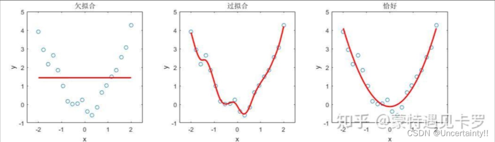

# 神经网络的并行运算

# cnn的神经元连接方式

# 训练中遇到的问题与学习相关的技巧

## 训练中可能遇到的问题

### 1. 欠拟合 (Underfitting) —— “还没入门的学生”

**【症状描述】**
模型在训练集上的准确率很低，在测试集上也很低。简单来说，就是模型根本“记不住”数据，像是一个怎么教都考不及格的学生。

**【成因诊断】**

1. **模型容量不足（脑容量不够）** ：网络太浅，神经元太少。就像让小学生去解微积分题目，他的知识结构支撑不了这么复杂的逻辑。
2. **特征工程缺失（课本太烂）** ：输入的数据太杂乱，没有提取出关键特征。
3. **优化失败（卡在半山腰）** ：

* 这是比较隐蔽的原因。我们希望梯度下降能带我们走到损失函数的 **全局最小值（谷底）** 。
* 但有时，梯度会卡在**局部极小值 (Local Minima)** 或者高维空间更常见的 **鞍点 (Saddle Point)** 。在这里，梯度接近于0，模型以为自己到了终点，实际上只是停在了半山腰的一个坑里。

**【处方/对策】**

* **增加复杂度** ：加深网络层数，增加每层的神经元数量。
* **减少约束** ：如果加了正则化（后面会讲），试着去掉它。
* **更换强力优化器** ：不要只用普通的 SGD（随机梯度下降）。试试 **Adam** 或带 **Momentum（动量）** 的优化器。它们就像给下山的小球加了一个“惯性”，遇到小坑能直接冲过去，不会轻易卡死。

### 2. 过拟合 (Overfitting) —— “死记硬背的书呆子”

**【症状描述】**
这是新手最容易遇到的问题。模型在训练集上表现堪称完美（Loss 接近 0，准确率 100%），但在测试集上表现一塌糊涂。

**【成因诊断】**
模型太强大（参数太多），而数据太少或者噪声太大。模型为了考高分，把数据中的“偶然噪声”也当成了“普遍规律”背了下来。比如，它看到训练集里的猫背景都有噪点，就认为“有噪点的才是猫”。

**【处方/对策：正则化 (Regularization)】**
*核心思想：给模型戴上“紧箍咒”，凡是限制模型复杂度的手段，都统称为正则化。*

1. **L1 / L2 正则化 (权值衰减 Weight Decay)** ：

* 我们在损失函数里加一个惩罚项。如果权重 $W$ 的数值太大，Loss 就会变大。
* 这强迫模型在保证预测准确的同时，尽量用更小的权重、更简单的曲线来拟合数据。

1. **Dropout (随机失活)** ：

* **操作** ：在训练时，每次随机让一部分神经元“下班”（将输出置为0）。
* **原理** ：
  * 这强迫模型不能依赖某几个特定的神经元（因为它们随时可能“下班”）。
  *  **本质** ：Dropout 实际上是一种 **低成本的集成学习** 。每一次 Iteration，我们都在训练一个不同的“残缺网络”，最终测试时，相当于把这些网络的智慧平均了起来。

1. **结构优化（小卷积核技巧）** ：

* 我们在 VGG 网络中见过这个技巧：用三个堆叠的 $3 \times 3$ 卷积层替代一个 $7 \times 7$ 卷积层。
* **原因** ：
  *  **减少参数** ：$3 \times (3 \times 3) = 27$，而 $1 \times (7 \times 7) = 49$。参数少了，过拟合风险自然降低。
  *  **增加非线性** ：三层卷积意味着有三次激活函数，网络的表达能力反而变强了。

1. **批量归一化 (Batch Normalization)** ：虽然它的主要功能是加速，但因为引入了随机性，也自带抗过拟合效果。

### 3. 梯度异常 —— “传话传丢了/传炸了”

**【症状描述】**

* **梯度消失 (Vanishing)** ：靠近输入层的参数几乎不更新，只有靠近输出层的几层在动。模型前面几层“罢工”了。
* **梯度爆炸 (Exploding)** ：Loss 突然变成 NaN（非数字），权重数值变得巨大。

**【成因诊断】**

* **链式法则的连乘效应** ：深度学习的反向传播是基于链式法则的（连乘）。
* 如果导数都小于 1（例如 0.9），乘个 100 次，$0.9^{100} \approx 0.00002$，梯度就没了。
* 如果导数都大于 1（例如 1.1），$1.1^{100} \approx 13780$，梯度就炸了。
* **激活函数背锅** ：早期的 **Sigmoid** 或 **Tanh** 函数，在输入值很大或很小时，导数几乎为 0（饱和区），极易导致梯度消失。

**【处方/对策】**

1. **换激活函数** ：使用  **ReLU** 。它在正区间的导数恒为 1，无论网络多深，梯度都能原样传回去。
2. **权重初始化** ：使用 He 初始化或 Xavier 初始化（稍后详述）。
3. **使用 BN (Batch Normalization)** ：强行把每一层的输入拉回到非饱和区。

### 4. 损失震荡 —— “醉汉走路”

**【症状描述】**
Loss 曲线不下降，而是忽高忽低，或者在一个数值附近剧烈波动，呈“之”字形。

**【成因诊断】**

1. **学习率 (Learning Rate) 太大** ：步子迈得太大，直接跨过了最低点，在峡谷两边来回横跳。
2. **Batch Size 太小** ：每次只看极少数样本来决定方向，随机性太大，指的路不准。

**【处方/对策】**

* **调小学习率** ：或者使用学习率衰减策略（开始快，后面慢）。
* **增大 Batch Size** ：让梯度方向更稳定。

## 第二板块：训练营——必备的实战技巧

治好了病，我们来看看如何通过科学的训练技巧，让模型更强壮。

### 1. 数据的“三大战区”

千万不要把所有数据一股脑扔进去训练，一定要科学划分：

* **训练集 (Train Set)** ：这是课本。模型平时就看这个，计算梯度，更新参数。
* **验证集 (Validation Set)** ：这是 **模拟考试** 。它 **不参与参数更新** ！我们用它来评估模型现在的水平，用来调整超参数（比如决定学多少轮、选哪个模型）。
* **测试集 (Test Set)** ：这是 **高考** 。只有在模型完全定型后，才能用它测一次。绝对不能在训练时偷看测试集，否则就是作弊。

**特殊技：K折交叉验证 (K-Fold Cross Validation)**

* **场景** ：数据少得可怜，切分出验证集太浪费了。
* **做法** ：把数据切成 K 份（比如 5 份）。轮流拿其中 1 份做验证，剩下 4 份做训练。最后取 5 次成绩的平均值。这就像把一本习题册撕成 5 章，轮流撕下一章来考试。

### 2. 训练的节奏：Batch 与 Epoch

这两个概念经常搞混，请务必分清：

* **Epoch** ：把**整本习题册（所有数据）**从头到尾做一遍，叫一个 Epoch。
* **Batch Size** ：由于内存有限，不能一次把整本书读进脑子。我们每次读一小撮数据（比如 64 个）来算梯度，这叫一个 Batch。

**选择技巧：**

* **Batch Size** ：
* 太小：训练慢，震荡严重，难以收敛（因为噪音大）。
* 太大：内存不够，且容易陷入局部最优（因为方向太确定了，缺乏随机性）。
* **推荐** ：32, 64, 128, 256（通常是 2 的幂次）。
* **Epoch** ：不是越多越好！要在验证集误差开始上升前停止。

### 3. 归一化神器：批量归一化 (Batch Normalization)

如果说深度学习有什么“神技”，BN 绝对算一个。

* **原理** ：数据在经过每一层运算后，分布都会跑偏（比如变得很大或很负）。BN 的作用就是 **强行把每一层的输入数据拉回到均值为 0、方差为 1 的标准正态分布** 。
* **好处** ：

1. **解决梯度消失** ：把数据拉回到激活函数的敏感区域。
2. **加速训练** ：你可以大胆使用更大的学习率。
3. **降低依赖** ：对初始权重的选择不那么敏感了。

### 4. 起跑线的艺术：权重初始值设定

我们在开始训练前，参数 $W$ 应该设为多少？

* **禁忌** ：**绝对不能全设为 0！**
* 如果 $W$ 全是 0，所有神经元进行的运算都一样，梯度的更新也一样。这会导致几百个神经元退化成一个神经元（对称性难题）。
* **科学设定** ：
* **Xavier 初始化** ：适用于 **Sigmoid** 或  **Tanh** 。它保证了输出和输入的方差一致。
* **He 初始化** ：专为 **ReLU** 设计。因为 ReLU 会把负值砍掉（变为0），信号量减半，所以 He 初始化让方差扩大了两倍来保持信号强度。
* **初始化陷阱** ：如果初始化不当（比如偏负），配合 ReLU（x<0 时梯度为 0），会导致神经元永久“死亡” (Dead ReLU)。
* **迁移学习 (Transfer Learning)** ：站在巨人的肩膀上。比如 VGG，可以使用在大规模数据集（ImageNet）上预训练好的权重作为初始值，这比随机初始化强得多。

### 5. 寻找最优解：超参数搜索

超参数（Hyperparameters）是指那些 **人设定的** 、不是模型自己学出来的参数（如学习率、Layer数、Batch Size）。怎么找最好的组合？

* **网格搜索 (Grid Search)** ：地毯式搜索，把所有组合试一遍。效率极低。
* **随机搜索 (Random Search)** ：在指定范围内随机取样。**推荐使用！** 理论证明在同等算力下，随机搜索更容易找到重要参数的最优值。
* **对数尺度 (Log Scale)** ：这是个很多人的盲区。
* 搜索学习率时，不要用线性刻度 (0.1, 0.2, 0.3...)。
* 要用**对数刻度** ($10^{-3}, 10^{-2}, 10^{-1}$...)。因为 0.001 和 0.01 的差别，比 0.1 和 0.2 的差别大得多！

### 6. 刹车机制：早停 (Early Stopping)

这是防止过拟合最简单有效的方法。
在训练时，死死盯着**验证集**的 Loss。一旦发现训练集 Loss 还在降，但验证集 Loss  **不降反升** （说明开始死记硬背了），立刻停止训练，并回滚到之前的最佳模型。

### 7. 团队作战：集成学习 (Ensemble Learning)

如果你想在比赛中刷分，这一招必不可少。

* **原理** ：“三个臭皮匠，顶个诸葛亮”。
* **方法** ：
* **投票 (Voting)** ：训练 5 个不同的模型，分类时少数服从多数。
* **平均 (Averaging)** ：回归问题，取 5 个模型预测值的平均数。
* 这个方法虽然增加了计算成本，但能显著提升模型的稳定性和准确率。

## 总结

模型训练不是一种“把代码跑通就完事”的工作，它更像是一种 **实验科学** 。

当我们遇到 Loss 不降、准确率低时，不要慌张。像医生一样去“望闻问切”：是梯度消失了？是过拟合了？还是学习率太大了？然后对症下药。

希望今天的这套“急救手册”和“训练心法”，能帮助大家在炼丹的路上少走弯路！谢谢大家！
