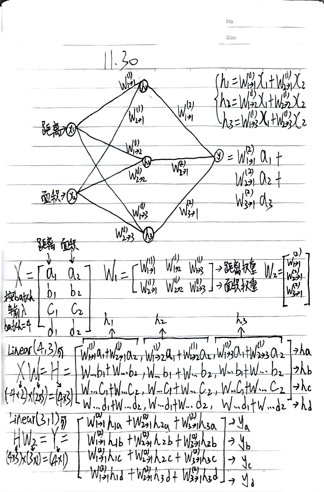

# 测试题

为了方便同学回顾所学知识，我们做了一份测试题，可以[点击此处](https://mdg-papergroup-1382022823.cos.ap-guangzhou.myqcloud.com/review-test.pdf)进行下载，分享会上已经详细评讲，本回顾笔记不再一一解析，同学可在题目最后一页查看答案。

你也可以线上做题，[点击进入](https://wayground.com/embed/quiz/6928206699f955c93b6d8fb6)

# 接下来的任务

经过此次分享会，相信大家已经掌握了模型训练的精髓，那么不妨拿 Kaggle 房价预测竞赛来练练手。

房价预测已经是我们的老朋友了，从一开始学习深度学习的举例时就用到了它，只是这一次输入的特征更多（不只有距离与面积），我们的目的是根据输入特征来预测房价输出，模型架构可由同学自由组合实现，因为我们当前主要学习有监督学习（使用深度学习实现），所以希望同学尽量使用神经网络模型，如果想用其他模型，可考虑集成学习。

**具体任务如下**：

- 进入[比赛页面](https://www.kaggle.com/competitions/house-prices-advanced-regression-techniques)，自行注册并参赛
- 下载数据集，自己实现模型并使用数据集进行训练
- 把模型对测试集的预测提交至竞赛
- 待平台对模型预测打分完毕进入Leardboard提交 **排名截图** 与你的 **模型代码** 至[论文复现提交处](https://f.wps.cn/g/ep5IgqHt/)，代号备注005
- 可以参考[《动手学深度学习》的指引](https://zh-v2.d2l.ai/chapter_multilayer-perceptrons/kaggle-house-price.html)
- 尽力就好，不勉强排名，主要是希望同学能够得到一次科研的锻炼

没有完成前面任务的同学可以继续完成，只要同学愿意完成，不论何时提交，我们都会及时查收并给予反馈

# 补充：神经网络的并行运算

接下来我们通过**双层神经网络（MLP）**的**矩阵乘法**运算来实现 **批量（Batch）** 的前向传播过程。

此处的内容完全围绕下图笔记展开描述，读者可以自行对照阅读：


我们常用房价预测来举全连接神经网络的例子，上次分享会提到我们不会只输入一个房子的例子。而是以矩阵形式批量输入多个房子的信息：

```plaintext
X = [
  [a1,  a2],   # 房子a: 距离市中心a1公里, 面积a2平米
  [b1,  b2],   # 房子b: 距离市中心b1公里, 面积b2平米
  [c1,  c2],   # 房子c: 距离市中心c1公里, 面积c2平米
  [d1,  d2]    # 房子d: 距离市中心d1公里, 面积d2平米
]
```

输入4个房子，所以输入为 `Batch Size = 4` ，下面我们来看看数据如何在矩阵维度上进行变换。

## 1. 网络结构与物理含义

* **输入层 (Input Layer)**:
  * 有 2 个节点：$x_1$ 代表 **距离**，$x_2$ 代表 **面积**。
  * 这是一个典型的回归或分类问题的输入特征（例如：根据房子的距离和面积预测房价）。
* **隐藏层 (Hidden Layer)**:
  * 有 3 个神经元：$h_1, h_2, h_3$。
  * 每个输入节点都与隐藏层所有节点相连（全连接）。
* **输出层 (Output Layer)**:
  * 有 1 个节点：$y$。
  * 它接收隐藏层的三个输出作为输入，计算最终结果。

**权重符号解读**:
作者使用了一种非常规范的标记法：$W^{(\text{层数})}_{\text{输入索引} \to \text{输出索引}}$

* 例如：$W^{(1)}_{1 \to 2}$ 表示 **第1层**权重，连接 **输入1 ($x_1$)** 到 **隐藏节点2 ($h_2$)**。

## 2. 矩阵定义的准备

### A. 输入矩阵 $X$

$$
X = \begin{bmatrix}
a_1 & a_2 \\
b_1 & b_2 \\
c_1 & c_2 \\
d_1 & d_2
\end{bmatrix}
$$

* **含义**: 这里定义了一个 `Batch Size = 4` 的输入数据。
* **结构**:
  * **行 (Rows)**: 代表 4 个不同的样本 (样本 a, b, c, d)。
  * **列 (Columns)**: 代表 2 个特征 (下标1是距离，下标2是面积)。
* **维度**: $(4 \times 2)$。

### B. 第一层权重矩阵 $W_1$

$$
W_1 = \begin{bmatrix}
W^{(1)}_{1\to1} & W^{(1)}_{1\to2} & W^{(1)}_{1\to3} \\
W^{(1)}_{2\to1} & W^{(1)}_{2\to2} & W^{(1)}_{2\to3}
\end{bmatrix}
$$

* **含义**: 将 2 个输入特征映射到 3 个隐藏神经元。
* **结构**:
  * 第一行对应“距离”特征的权重。
  * 第二行对应“面积”特征的权重。
* **维度**: $(2 \times 3)$。

### C. 第二层权重矩阵 $W_2$

$$
W_2 = \begin{bmatrix}
W^{(2)}_{1\to1} \\
W^{(2)}_{2\to1} \\
W^{(2)}_{3\to1}
\end{bmatrix}
$$

* **含义**: 将 3 个隐藏特征映射到 1 个输出值。
* **维度**: $(3 \times 1)$。

## 3. 前向传播的核心推导

### 第一步：输入层 $\to$ 隐藏层 (Linear(2, 3))

公式：$X W_1 = H$
我们提到过矩阵乘法必须要前后行列匹配：

$$
(4 \times 2) \times (2 \times 3) = (4 \times 3)
$$

* **结果矩阵 $H$**:
  * 结果是一个 $4 \times 3$ 的矩阵。
  * **每一行**（如 $h_a$）代表样本 $a$ 在隐藏层的 3 个特征值。
  * **细节**: 笔记中写出了具体的一项，例如 $W^{(1)}_{1\to1}a_1 + W^{(1)}_{2\to1}a_2$。这正是神经元 $h_1$ 对样本 $a$ 的计算公式：**(距离 $\times$ 权重) + (面积 $\times$ 权重)**。

### 第二步：隐藏层 $\to$ 输出层 (Linear(3, 1))

公式：$H W_2 = Y$

$$
(4 \times 3) \times (3 \times 1) = (4 \times 1)
$$

* **结果矩阵 $Y$**:
  * 结果是一个 $4 \times 1$ 的列向量。
  * **含义**: 包含了 4 个样本的最终预测值 ($y_a, y_b, y_c, y_d$)。
  * **细节**: 笔记中展示了 $W^{(2)}_{1\to1}h_{1a} + W^{(2)}_{2\to1}h_{2a} + W^{(2)}_{3\to1}h_{3a} \to y_a$。这表示将样本 $a$ 的三个隐藏状态加权求和，得到最终输出。

## 4. 总结

这其实就是深度学习框架（如 PyTorch 或 TensorFlow）内部的工作原理：

1. **并行计算 (Batch Processing)**: 笔记清晰地展示了为什么我们要把数据打包成 Batch。通过矩阵乘法，我们可以**一次性**计算出 4 个样本的结果（$y_a$ 到 $y_d$），而不是写 4 个循环分别计算。这就是 GPU 加速的基础。
2. **维度变换**:
   * 输入 $(4 \times 2)$
   * $\xrightarrow{\text{乘 } (2 \times 3)}$ 变成隐藏状态 $(4 \times 3)$
   * $\xrightarrow{\text{乘 } (3 \times 1)}$ 变成输出 $(4 \times 1)$
   * 此处矩阵的维度的变化逻辑完全等价于神经网络层前后的升/降维，符合 `Linear(in_features, out_features)` 的定义。

对应 PyTorch 的代码：

```python
import torch

# Batch size = 4, Input features = 2
X = torch.randn(4, 2) 

# Layer 1: 2 inputs -> 3 hidden
linear1 = torch.nn.Linear(2, 3, bias=False) 

# Layer 2: 3 hidden -> 1 output
linear2 = torch.nn.Linear(3, 1, bias=False)

# Forward pass (对应上述的计算)
H = linear1(X)  # 也就是 X x W1.T
Y = linear2(H)  # 也就是 H x W2.T
```

如果你还是没有看懂上述的笔记，不妨结合下方动画加深理解：


# 补充：cnn的神经元连接方式

很多人在学习 CNN 时，会被“叠方块”的宏观视图（结构图）掩盖了微观的连接细节。

要理解 CNN 神经元之间的连接，我们需要把思维从全连接层（MLP）的“全员大乱炖”转换到 CNN 的 **“局部专注 + 深度贯穿”** 。

### 1. 视角的转换：从“一列”到“一张”

在 MLP 中，无论输入图片是几维的（比如 $28 \times 28$ 的像素），我们第一步都是把它“拍扁”拉直成一个长向量（$784$ 个节点）。

但在 CNN 中，**我们必须保留空间结构**。

* **输入层：** 不再是一列神经元，而是一个**三维矩阵**（宽 $\times$ 高 $\times$ 通道数）。
* **隐藏层（特征图）：** 这一层里的神经元，也是以**二维网格**（矩阵）的形式排列的。

**关键点：** 我们现在要研究的是，**隐藏层（特征图）里的某一个特定的神经元**，它是怎么把“电线”连到输入层去的。

### 2. 核心连接机制：全连接 vs. 卷积连接

这是最核心的区别。假设输入是一个 $5 \times 5$ 的图像，全连接层和卷积层的一个神经元连接方式如下：

#### MLP（全连接）的连法：

隐藏层的**一个神经元**，会伸出 $5 \times 5 = 25$ 根电线，连接到输入图片的**每一个像素**。

* 如果输入的下一层 100 个神经元，就是 $100 \times 25$ 根线。

#### CNN（卷积）的连法：

隐藏层（Feature Map）上的**一个神经元**，**只关心输入图片的一小块区域**（这叫做**局部连接**或感受野）。

假设卷积核（Filter）大小是 $3 \times 3$：

1. **连接范围（空间上）：** 这个神经元只伸出 $3 \times 3 = 9$ 根线，例如连接到输入图片左上角的那个 $3 \times 3$ 区域。它**完全无视**在这个区域之外的像素。
2. **连接深度（通道上）：** 这是最容易被忽略的！如果输入图片是彩色的（RGB 3通道），那么这个神经元的 $3 \times 3$ 窗口必须**贯穿所有通道**。
   * 实际连接数 = $3 \text{ (宽)} \times 3 \text{ (高)} \times 3 \text{ (RGB通道)} = 27$ 根线，每根线上有自己独立的权重（这些线的权重排列起来就变成我们看见的卷积核）。

> **形象比喻：**
>
> * **MLP 神经元**像是一个**上帝之眼**，它一眼要看全整张图，然后得出一个数值。
> * **CNN 神经元**像是一个拿着放大镜的**质检员**，它只盯着图片左上角的一小块区域看。

### 3. 真正的连接图景：神经元阵列与权值共享

你可能会问：“既然一个神经元只看一小块区域，那图片其他部分谁来看？”

这就引出了 CNN 神经元排列的真相。我们在资料中看到的“特征图（Feature Map）”，其实就是**一排排站好的质检员（神经元）**。

假设输入是 $5 \times 5$，卷积核是 $3 \times 3$，步长为 1，没有 Padding：

1. **第一个神经元（位置 0,0）：** 连接输入图片左上角的 $3 \times 3$ 区域。
2. **第二个神经元（位置 0,1）：** 站在第一个人旁边，连接输入图片**向右平移一格**的 $3 \times 3$ 区域。
3. **...以此类推。**

最后生成的 $3 \times 3$ 输出特征图，实际上包含了 9 个独立的神经元。

#### “权值共享”在连接上的意义

在 MLP 中，每个神经元的连接线都有自己独立的权重（Weight）。
但在 CNN 的**同一张特征图**上，上述那 9 个神经元，虽然连接的位置不同（因为它们看图片的部位不同），但它们手中的**连接线的粗细（权重）是完全一样的！**

* 这就是为什么我们说它是一个“Filter”在滑动。
* **物理本质：** 是无数个神经元铺满了整个视野，但它们使用的是同一套参数来从不同的位置提取同样的特征（比如都负责找“竖线”）。

### 4. 总结对比表

我们将 MLP 和 CNN 的神经元连接进行微观对比：

| 特性                 | MLP (全连接) 神经元                    | CNN (卷积) 神经元                                           |
| :------------------- | :------------------------------------- | :---------------------------------------------------------- |
| **输入来源**   | 连接上一层**所有**的神经元       | 仅连接上一层**局部区域** (如 $3 \times 3$) 的神经元 |
| **通道处理**   | 无通道概念，视为一长列                 | **全深度连接** (连接局部区域内的所有通道)             |
| **神经元排列** | 一列排开，互不相关                     | 二维排列，对应空间位置                                      |
| **权重参数**   | 每个神经元拥有**独立**的一组权重 | 同一张特征图上的所有神经元**共享**同一组权重          |
| **数量级**     | 参数量巨大 (易过拟合)                  | 参数量极小 (连接稀疏 + 共享)                                |

读者可以观看下方动画加深理解：

最后给大家留下两个问题，可以自行思考一下：

1. **反向传播的差异：** 既然 CNN 的权重是共享的，也就是多个神经元共用同一组 $W$，那么在训练时，梯度的更新是如何在这些神经元之间分配和计算的？
2. **$1 \times 1$ 卷积的魔力：** 既然卷积是看局部，$1 \times 1$ 卷积只看一个像素，那它和 MLP 有什么区别？我们在vgg中也见过它，它为什么被称为“通道融合器”？

# 训练中遇到的问题与学习相关的技巧

## 训练中可能遇到的问题

### 1. 欠拟合 (Underfitting) —— “还没入门的学生”

**【症状描述】**
模型在训练集上的准确率很低，在测试集上也很低。简单来说，就是模型根本“记不住”数据，像是一个怎么教都考不及格的学生。

**【成因诊断】**

1. **模型容量不足（脑容量不够）** ：网络太浅，神经元太少。就像让小学生去解微积分题目，他的知识结构支撑不了这么复杂的逻辑（非线性拟合能力欠缺）。
2. **特征工程缺失（课本太烂）** ：输入的数据太杂乱，没有提取出关键特征。
3. **欠优状态（梯度卡在半山腰）** ：

* 这是比较隐蔽的原因。我们希望梯度下降能带我们走到损失函数的 **全局最小值（谷底）** 。
* 但有时，梯度会卡在**局部极小值 (Local Minima)** 或者高维空间更常见的 **鞍点 (Saddle Point)** 。在这里，梯度接近于0，模型以为自己到了终点，实际上只是停在了半山腰的一个坑里。

**【处方/对策】**

* **增加复杂度** ：加深网络层数，增加每层的神经元数量。
* **减少约束** ：如果加了正则化（后面会讲），可能是正则化使用不当，试着去掉它。
* **更换强力优化器** ：不要只用普通的 SGD（随机梯度下降）。试试 **Adam** 或带 **Momentum（动量）** 的优化器。它们就像给下山的小球加了一个“惯性”，遇到小坑能直接冲过去，不会轻易卡死。

### 2. 过拟合 (Overfitting) —— “死记硬背的书呆子”

**【症状描述】**
这是新手最容易遇到的问题。模型在训练集上表现堪称完美（Loss 接近 0，准确率 100%），但在测试集上表现一塌糊涂。

**【成因诊断】**
模型太强大（参数太多），而数据太少或者噪声太大。模型为了考高分，把数据中的“偶然噪声”也当成了“普遍规律”背了下来。比如，它看到训练集里的猫背景都有噪点，就认为“有噪点的才是猫”。

**【处方/对策】**

**对策1：正则化 (Regularization)**
*核心思想：给模型戴上“紧箍咒”，凡是限制模型复杂度的手段，都统称为正则化。*

1. **L1 / L2 正则化 (权值衰减 Weight Decay)** ：

* 我们在损失函数里加一个惩罚项。如果权重 $W$ 的数值太大，Loss 就会变大。
* 这强迫模型在保证预测准确的同时，尽量用更小的权重、更简单的曲线来拟合数据。
* **L1 vs L2 的区别**：
  | 类型 | 惩罚项 | 效果 | 适用场景 |
  |------|--------|------|----------|
  | **L1** | $\lambda \sum |W|$ | 产生**稀疏解**，让很多权重直接变成 0 | 特征选择，希望模型自动忽略无用特征 |
  | **L2** | $\lambda \sum W^2$ | 让权重**均匀变小**，但不会变成 0 | 防止某个权重过大，更常用 |

2. **Dropout (随机失活)** ：

* **操作** ：在训练时，每次随机让一部分神经元“下班”（随机屏蔽神经元输出）。
* **原理** ：
  * 这强迫模型不能依赖某几个特定的神经元（因为它们随时可能“下班”）。
  * **本质** ：Dropout 实际上是一种 **低成本的集成学习** 。每一次 Iteration，我们都在训练一个不同的“残缺网络”，最终测试时，相当于把这些网络的智慧平均了起来。

3. **结构优化（小卷积核技巧）** ：

* 我们在 VGG 网络中见过这个技巧：用三个堆叠的 $3 \times 3$ 卷积层替代一个 $7 \times 7$ 卷积层。
* **原因** ：
  * **减少参数** ：$3 \times (3 \times 3) = 27$，而 $1 \times (7 \times 7) = 49$。参数少了，过拟合风险自然降低。
  * **增加非线性** ：三层卷积意味着有三次激活函数，网络的表达能力反而变强了。

**对策2：数据增强 (Data Augmentation)**

数据增强是防止过拟合非常有效的手段，尤其在图像任务中几乎是标配。

* **核心思想**：通过对原始数据进行变换，人工"创造"更多训练样本，让模型见过更多样的数据。
* **常见方法（以图像为例）**：
  | 方法 | 描述 | 示例 |
  |------|------|------|
  | **翻转** | 水平/垂直翻转图片 | 猫朝左 → 猫朝右 |
  | **旋转** | 随机旋转一定角度 | 旋转 ±15° |
  | **裁剪** | 随机裁剪图片的一部分 | RandomCrop |
  | **缩放** | 随机缩放图片大小 | 0.8x ~ 1.2x |
  | **颜色抖动** | 随机调整亮度、对比度、饱和度 | ColorJitter |
  | **Mixup / CutMix** | 将两张图片混合或剪切拼接 | 高级技巧 |

* **注意**：数据增强只在**训练时**使用，测试时不做增强！

**对策3：批量归一化 (Batch Normalization)**
虽然它的主要功能是加速，但因为引入了随机性，也自带抗过拟合效果。

- 引入了随机性：在训练时，每个 mini-batch 的均值和方差是根据当前 batch 计算的，不同 batch 会产生不同的归一化结果，这类似于 Dropout 的随机扰动效果。
- 减少了对特定神经元的依赖：由于归一化过程，模型不太容易过度依赖某些特定的激活值。

**读者可以通过动画再次理解三种拟合情况：**


### 3. 梯度异常 —— “损失责任传丢了/传炸了”

**【症状描述】**

* **梯度消失 (Vanishing)** ：靠近输入层的参数几乎不更新，只有靠近输出层的几层在动。模型前面几层“罢工”了。
* **梯度爆炸 (Exploding)** ：Loss 突然变成 NaN（非数字），权重数值变得巨大。

**【成因诊断】**

* **链式法则的连乘效应** ：深度学习的反向传播是基于链式法则的（连乘）。
* 如果导数都小于 1（例如 0.9），乘个 100 次，$0.9^{100} \approx 0.00002$，梯度就没了。
* 如果导数都大于 1（例如 1.1），$1.1^{100} \approx 13780$，梯度就炸了。
* **激活函数背锅** ：早期的 **Sigmoid** 或 **Tanh** 函数，在输入值很大或很小时，导数几乎为 0（饱和区），极易导致梯度消失。

**【处方/对策】**

1. **换激活函数** ：使用  **ReLU** 。它在正区间的导数恒为 1，无论网络多深，梯度都能原样传回去。
2. **权重初始化** ：使用 He 初始化或 Xavier 初始化（稍后详述）。
3. **使用 BN (Batch Normalization)** ：强行把每一层的输入拉回到非饱和区。

### 4. 损失震荡 —— “醉汉走路”

**【症状描述】**
Loss 曲线不下降，而是忽高忽低，或者在一个数值附近剧烈波动，呈“之”字形。

**【成因诊断】**

1. **学习率 (Learning Rate) 太大** ：步子迈得太大，直接跨过了最低点，在峡谷两边来回横跳。
2. **Batch Size 太小** ：每次只看极少数样本来决定方向，随机性太大，梯度指的路不准。

**【处方/对策】**

* **调小学习率** ：或者使用学习率衰减策略（开始快，后面慢）。常见策略包括：
  * **StepLR**：每隔固定 epoch 将学习率乘以一个因子（如 0.1）
  * **ExponentialLR**：每个 epoch 学习率指数衰减
  * **CosineAnnealingLR**：学习率按余弦函数周期性变化，平滑且效果好
  * **ReduceLROnPlateau**：监控验证集 Loss，当它不再下降时自动衰减
* **增大 Batch Size** ：让梯度方向更稳定。

## 学习相关的技巧

如何通过科学的训练技巧，让模型更强壮？

### 1. 数据预处理：输入归一化

在把数据喂给神经网络之前，我们通常需要对原始数据进行 **归一化（Normalization）** 处理。

**【为什么要做？】**

假设我们预测房价，输入特征有：
- 距离市中心：1~50 公里
- 面积：50~500 平方米

如果不归一化，"面积"的数值远大于"距离"，会导致：
1. **梯度更新不均衡**：面积对应的权重更新幅度会远大于距离。
2. **收敛困难**：损失函数的等高线会变成又细又长的椭圆，梯度下降会来回震荡。

**【常用方法】**

| 方法 | 公式 | 结果范围 | 适用场景 |
|------|------|----------|----------|
| **Min-Max 归一化** | $x' = \frac{x - x_{min}}{x_{max} - x_{min}}$ | $[0, 1]$ | 数据有明确边界时 |
| **Z-Score 标准化** | $x' = \frac{x - \mu}{\sigma}$ | 均值0，方差1 | 数据近似正态分布时 |

**【注意事项】**

- **训练集和测试集要用同一套参数**：用训练集计算的 $\mu$、$\sigma$（或 $x_{min}$、$x_{max}$）去归一化测试集，不能分别计算！
- **这是数据预处理，不是 Batch Normalization**：输入归一化在训练前做一次；BN 是网络中的一层，在训练过程中动态进行。

### 2. 数据的"三大战区"

千万不要把所有数据一股脑扔进去训练，一定要科学划分：

* **训练集 (Train Set)** ：这是课本。模型平时就看这个，计算梯度，更新参数。
* **验证集 (Validation Set)** ：这是 **模拟考试** 。它 **不参与参数更新** ！我们用它来评估模型现在的水平，调整超参数（比如决定学多少轮、选哪个模型）。
* **测试集 (Test Set)** ：这是 **高考** 。只有在模型完全定型后，才能用它测一次。绝对不能在训练时偷看测试集，否则就是作弊。

**特殊技：K折交叉验证 (K-Fold Cross Validation)**

* **场景** ：数据少得可怜，切分出验证集太浪费了，我们需要尽可能多地利用现有的数据。
* **做法** ：把数据切成 K 份（比如 5 份）。轮流拿其中 1 份做验证，剩下 4 份做训练。最后取 5 次成绩的平均值。这就像把一本习题册撕成 5 章，轮流撕下一章来考试。

### 3. 训练的节奏：Batch 与 Epoch

* **Epoch** ：把 **整本习题册（所有数据）** 从头到尾做一遍，叫一个 Epoch。
* **Batch Size** ：由于内存有限，不能一次把整本书读进脑子。我们每次读一小撮数据（比如 64 个）来算梯度，这叫一个 Batch。

**选择技巧：**

* **Batch Size** ：
* 太小：训练慢，震荡严重，难以收敛（因为噪音大）。
* 太大：内存不够，且容易陷入局部最优（因为方向太确定了，缺乏随机性）。
* **推荐** ：32, 64, 128, 256（通常是 2 的幂次）。
* **Epoch** ：不是越多越好！要在验证集误差开始上升前停止。

### 4. 归一化神器：批量归一化 (Batch Normalization)

如果说深度学习有什么“神技”，BN 绝对算一个。

* **原理** ：数据在经过每一层运算后，分布都会跑偏（比如变得很大或很负）。BN 的作用就是 **强行把每一层的输入数据拉回到均值为 0、方差为 1 的标准正态分布** 。
* **好处** ：

1. **解决梯度消失** ：把数据拉回到激活函数的敏感区域。
2. **加速训练** ：你可以大胆使用更大的学习率。
3. **降低依赖** ：对初始权重的选择不那么敏感了。

### 5. 起跑线的艺术：权重初始值设定

我们在开始训练前，参数 $W$ 应该设为多少？

* **禁忌** ：**绝对不能全设为 0！**
* 如果 $W$ 全是 0，所有神经元进行的运算都一样，梯度的更新也一样。这会导致几百个神经元退化成一个神经元（对称性难题）。
* **科学设定** ：
* **Xavier 初始化** ：适用于 **Sigmoid** 或  **Tanh** 。它保证了输出和输入的方差一致。
  * 公式：$W \sim \mathcal{N}\left(0, \frac{2}{n_{in} + n_{out}}\right)$ 或 $W \sim U\left(-\sqrt{\frac{6}{n_{in}+n_{out}}}, \sqrt{\frac{6}{n_{in}+n_{out}}}\right)$
  * 其中 $n_{in}$ 是输入神经元数，$n_{out}$ 是输出神经元数。
* **He 初始化** ：专为 **ReLU** 设计。因为 ReLU 会把负值砍掉（变为0），信号量减半，所以 He 初始化让方差扩大了两倍来保持信号强度。
  * 公式：$W \sim \mathcal{N}\left(0, \frac{2}{n_{in}}\right)$
  * 注意分母只有 $n_{in}$，且分子是 2（对比 Xavier 的 $\frac{2}{n_{in}+n_{out}}$）。
* **初始化陷阱** ：如果初始化不当（比如偏负），配合 ReLU（x<0 时梯度为 0），会导致神经元永久“死亡” (Dead ReLU)。
* **迁移学习 (Transfer Learning)** ：站在巨人的肩膀上。比如 VGG，可以使用在大规模数据集（ImageNet）上预训练好的权重作为初始值，这比随机初始化强得多。

### 6. 寻找最优解：超参数搜索

超参数（Hyperparameters）是指那些 **人设定的** 、不是模型自己学出来的参数（如学习率、Layer数、Batch Size）。怎么找最好的组合？

* **网格搜索 (Grid Search)** ：地毯式搜索，把所有组合试一遍。效率极低。
* **随机搜索 (Random Search)** ：在指定范围内随机取样。**推荐使用！** 理论证明在同等算力下，随机搜索更容易找到重要参数的最优值。
* **对数尺度 (Log Scale)** ：这是个很多人的盲区。
* 搜索学习率时，不要用线性刻度 (0.1, 0.2, 0.3...)。
* 要用**对数刻度** ($10^{-3}, 10^{-2}, 10^{-1}$...)。因为 0.001 和 0.01 的差别，比 0.1 和 0.2 的差别大得多！

### 7. 刹车机制：早停 (Early Stopping)

这是防止过拟合最简单有效的方法。
在训练时，死死盯着**验证集**的 Loss。一旦发现训练集 Loss 还在降，但验证集 Loss  **不降反升** （说明开始死记硬背了），立刻停止训练，并回滚到之前的最佳模型。

**Patience（耐心值）**：实际中我们不会“一次不降就停”，而是设定一个 patience 值（如 5 或 10），表示“如果连续 N 个 epoch 验证集 Loss 都没有改善，才停止训练”。这样可以避免因偶然波动而过早停止。

### 8. 团队作战：集成学习 (Ensemble Learning)

如果你想在比赛中刷分，这一招必不可少。

* **原理** ：通过集成多个模型（例如不同架构或不同训练随机种子），通常能提升预测的稳定性与泛化性能。
* **方法** ：
* **投票 (Voting)** ：用于分类问题。训练多个不同的模型，最终预测时少数服从多数。
* **平均 (Averaging)** ：用于回归问题。取多个模型预测值的简单平均或加权平均 (Weighted Averaging)。
* 这些集成的多个模型可以是不同的，例如神经网络+决策树
* 这个方法虽然增加了计算成本，但能显著提升模型的稳定性和准确率。
