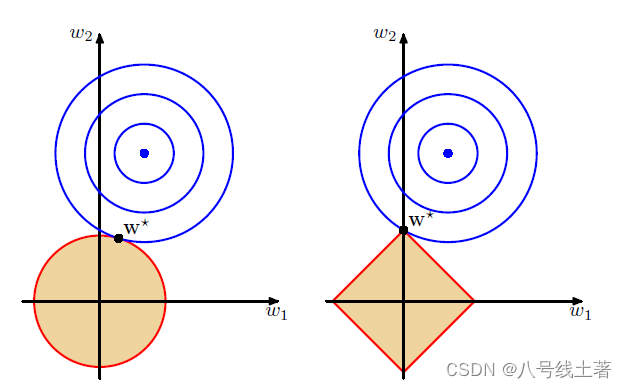
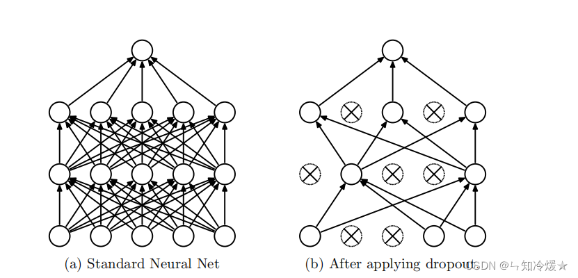

# 我们接下来的任务

在阅读完VGG论文之后,我们希望大家能够进一步深入阅读VGG的代码实现,重点理解论文中提出的网络结构是如何通过代码复现出来的。

**代码复现能力是科研工作中不可或缺的核心能力之一**。掌握这项能力后,我们不仅能够复用他人的先进技术来提升自己的模型性能,还能在阅读优秀代码的过程中获得新的思路和灵感。当然,这需要长期的积累和练习。我们建议从观察和理解他人的复现代码入手,逐步培养代码阅读和复现能力。

以下为大家准备了两份VGG的代码实现:

1. 通过[这里](https://mdg-papergroup-1382022823.cos.ap-guangzhou.myqcloud.com/vggNet.zip)下载VGG的基础实现代码
2. 如果你追求更规范、更工程化的代码,可以查看[PyTorch官方的代码实现](https://github.com/pytorch/vision/blob/main/torchvision/models/vgg.py)

**注意事项**:
- VGG团队的官方代码使用MATLAB实现,本次学习我们不涉及,感兴趣的同学可以自行了解
- 在实际的代码中,你可能会发现许多实现**并未包含论文中提到的所有技术细节**(如模型集成、浅层预训练等),而是专注于核心网络结构的复现——这是完全正常的现象
- 重点是能理解网络结构的代码实现思路和编程技巧,所以此次代码不追求完全还原论文的所有实验

> 没有完成上次Kaggle竞赛的同学可以先放一放此次的任务
> 如果还是难以理解花书写的代码可以观看[李沐的讲解](https://www.bilibili.com/video/BV1NK4y1P7Tu/?share_source=copy_web&vd_source=2ce9574f7e97cdd1f936211a10045041)
> 对决策树集成感兴趣的同学可以看[这里对于决策树的实现](https://www.bilibili.com/video/BV13H4y1B7ma?vd_source=2ce9574f7e97cdd1f936211a10045041)，具体集成方式自行探究

# 过拟合与正则化

## 什么是过拟合

过拟合（overfitting）是指模型在训练数据上表现很好，但在未见过的测试数据或实际应用场景中表现较差的现象。换言之，模型学到了训练数据中的噪声或偶然性模式，而不是学习到数据的潜在、可泛化的规律。

常见表现：训练误差持续减小，但验证/测试误差在某一时刻开始上升。

## 过拟合的原因

- **模型过于复杂**：**参数太多**（高容量模型）可以拟合训练集中的噪声。（**参数量与参数的大小决定了模型的复杂度**）
- **训练数据不足**：**样本数太少**或不具代表性，模型容易记忆样本特异性。
- **标签噪声或异常值**：错误标签或异常点会引导模型学习不正确的规律。
- **特征冗余或高相关性**：很多无关或共线性特征会增加学习难度。
- **训练时间过长**：在神经网络中训练轮数太多，会使模型更倾向记忆训练集（模型自发去完美契合测试集）。

## 什么是正则化

正则化（regularization）是一组旨在提高模型泛化能力的技术。正则化通过在学习过程中引入偏置或约束，通过**约束模型训练**，抑制模型对训练数据噪声的过度拟合，从而在未见数据上取得更好的表现。

### 正则化的核心

- **控制模型复杂度**：惩罚过大的权重或参数，降低模型容量。
- **引入偏置以降低方差**：适度偏置能换取更小的方差，整体减小泛化误差。
- **增加鲁棒性或稀疏性**：使模型对输入噪声更不敏感（例如权重变小或稀疏），便于解释与部署。（稀疏是化筛选重要参数的过程，而减小参数则减小了模型的复杂度）

## 常见的正则化技术

### 1) L2 正则化（权重衰减）

- **公式（损失函数）**：对于原始损失函数 $\mathcal{L}(w)$，L2 正则化常写为

$$
\mathcal{L}_{\text{L2}}(w)=\mathcal{L}(w)+{\lambda}\sum_{i} w_i^2
$$

  其中 $w$ 表示模型的可学习参数向量，$\lambda>0$ 为正则化强度（超参数）。

**为什么缓解过拟合**：L2 **惩罚大权重**，使得模型参数趋于较小的数值，从而限制模型复杂度。小的权重意味着模型对输入变化的敏感性降低（更平滑的函数），减少对训练集噪声的拟合。

- **效果与特点**：

  - 有“权重衰减”（weight decay）的效果；梯度更新时会把权重按比例缩小。
  - 不会强制产生严格的稀疏解（大多权重变小，但很少精确为零），区别于L1。

### 2) L1 正则化（Lasso 风格）

- **公式（损失函数）**：

$$
\mathcal{L}_{\text{L1}}(w)=\mathcal{L}(w)+\lambda\sum_{i}|w_i|
$$

  同样 $\lambda>0$ 为正则化强度。

- **为什么缓解过拟合**：L1 惩罚对权重的绝对值求和，会**鼓励许多权重变为零**，从而得到稀疏模型，当 越大，惩罚越激烈，部分参数越趋近于0。稀疏性等价于进行**特征选择**，丢弃不重要的特征，减少模型复杂度，从而降低过拟合风险。
- **效果与特点**：

  - 导致稀疏解（很多权重精确为零），便于解释和特征选择。
  - 对参数估计有偏差（尤其是在强正则化下），可能导致欠拟合如果 $\lambda$ 过大，即置0的参数过多，导致模型复杂度偏低。
  - 在高维稀疏问题上非常有用（筛选重要参数）。

### L1与L2的几何解释

设θ为L1与L2所被限制的程度。L1：|w1| + |w2|<θ ，其几何图像显然是一个菱形 ， L2：$w_1^2 + w_2^2$<θ，显然是一个圆

蓝色线条是损失值的的等值线，其中心的蓝色圆心是损失的最小值。当w1和w2在参数空间内寻找最优解时，蓝色区域由蓝色圆心向外不断扩大，当与阴影区域第一次相切时为最优解 W*。可见，**不同点在于L2的最优解W**在拐角处取得的可能性较低，而L1的最优解会在拐角处（0，w2）取得的可能性较高，而*在高维空间内，除了拐点以外，还有很多边的轮廓可以取得最优解，于L1而言，这又会产生更多的稀疏性。*

### 3) Dropout（随机失活）

- **方法概述**：Dropout 在训练过程中以概率 $p$（通常表示丢弃概率）随机“屏蔽”神经元的输出（即将其设为 0），从而在每次前向传播时都使用一个随机子网络进行训练（随机性）。

  
- **输出的期望值**：由于Dropout的随机性，同一输入多次通过网络所得输出的 **平均值** 。它代表了网络输出的“标准水平”
- 什么是**缩放**，为什么需要缩放：

  - Dropout在训练时随机“关闭”一部分神经元，导致在该阶段实际参与计算的神经元总数变少。如果在测试时不作任何处理，那么所有神经元都参与工作的测试网络，其输出的**期望值（均值）会显著高于**训练时使用网络，这打破了数据分布的稳定性，使得模型预测变得极不稳定。
  - 换句话说，在训练时，因为总有一部分神经元（比如一半）不工作，整个网络的“输出功率”只有正常水平的一部分，而网络只适应了这一部分的训练。到了测试时，如果所有神经元都恢复工作且不做任何处理，网络的“输出功率”会突然恢复到100%，这将会是网络从未见过的情况与数据
  - 此时便需要同一平衡训练与测试网络的神经元以统一期望值，也就是缩放
- 缩放策略：训练/测试阶段则通常按比例**缩放**或使用完整网络的权重

  - 做法一：在训练时保留概率为 $q=1-p$，测试时将激活乘以 $q$，（对测试集缩放）。
  - 做法二：在训练时对非丢弃的激活做缩放，将未丢弃神经元的激活值乘以 1/q（对训练集缩放）。
- **为什么缓解过拟合**：Dropout 通过在训练时随机去除一部分神经元，迫使网络**不能依赖于特定神经元的存在**，从而减少神经元之间的“共适应”（co-adaptation）。一方面去除了神经元，我们原来的网络就变成了一个更加精简的模型，参数量下降了，另一方面由于我们限制了对特定神经元的依赖，每个神经元都不能保证被保留在神经网络中，也就不可能给某一个特点的神经元赋予一个过大的权重，即减小了模型的参数范围大小
- **效果与特点**：

  - 对深度神经网络非常有效，常用于全连接层的正则化。
  - 增加训练噪声，需要更长训练时间和合适的学习率调整。
  - 与 BatchNorm 一起使用时需注意顺序与缩放策略（某些场景下 BatchNorm 已有正则化效果，dropout 的作用减弱）。
  - 注意：在推理时需要缩放（或使用反向训练缩放技巧）以保证一致性。

## 三者的比较与选用建议

- **L2（权重衰减）**：通用、安全，适合大多数场景；尤其对连续光滑模型有良好效果；不会产生稀疏解。
- **L1（稀疏正则）**：适合需要特征选择或稀疏模型的场景（高维稀疏问题）；对解释性有利。
- **Dropout**：深度网络（尤其全连接层）效果显著，相当于训练多个子网络并做集合平均；常与 L2 结合使用获得更好效果。

在实践中，常常将多种正则化组合使用，例如在神经网络中同时使用 L2 和 Dropout；在需要稀疏特征的线性模型中使用 L1 或 Elastic Net（L1 和 L2 的组合）。超参数（例如 $\lambda$、dropout 比例 $p$）应通过验证集或交叉验证来选择。

## 总结要点

- 过拟合是模型对训练数据噪声的记忆，导致泛化性能差。
- 正则化通过限制模型复杂度或引入随机性来提高泛化能力。
- L2 使权重变小、平滑模型；L1 促使稀疏性并有特征选择效果；Dropout 通过随机失活起到集成式正则化、减少共适应。

---
