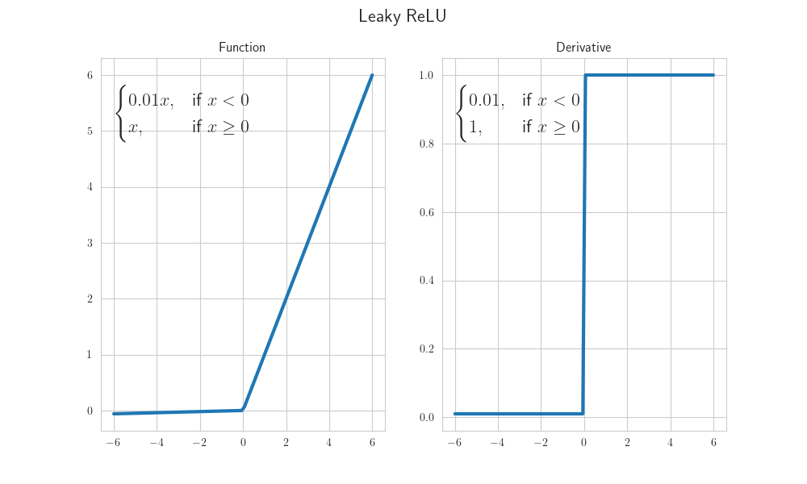

# 我们接下来的任务
实际上我们原本打算这学期把经典深度学习学完，看完四篇论文。但进度推了很多，一方面是体测停了两周，另一方面也是大家觉得任务比较赶，担心大家因为任务跟进不上停滞了学习，所以不得不放慢了进度，后期也没有讲太多新内容，一直是对之前内容进行原理补充。

虽然进度慢了下来，但每次上交任务的同学依旧比较少，尤其是一些实践任务，其实光学习理论远远不够，实践才是学以致用的体现，我们布置的任务并非毫无意义的。

其实上届论文复现组并没有我们今年那么系统的理论学习，部长的很多知识完全是在当年的课后的实践作业中顺带了解的，所以也希望大家可以以积极的心态完成任务，这个过程中带给大家的收获是远大于分享会的。

**寒假任务安排（可选但建议）**
1. 阅读vgg的代码
2. 和之前一样，在开始强化学习之前，希望大家可以先行阅读书本上相关的概念介绍，以下推荐两本强化学习书籍，大家根据需求选择一本书阅读：
   * 《白话强化学习与Pytorch》：在用大白话与你聊天的过程中不知不觉学完了强化学习的基本概念，数学推导较少，内容深度较浅
      * 你可以在[此处](https://yun.weicheng.men/Book/%E7%99%BD%E8%AF%9D%E5%BC%BA%E5%8C%96%E5%AD%A6%E4%B9%A0%E4%B8%8EPyTorch.pdf)下载本书，我们只对1-5章的传统篇做阅读要求，如果同学觉得书本很精彩，可以根据兴趣阅读其他部分
   * 《Easy RL 蘑菇书》：理论体系完整，原理讲解深入且透彻，数学推导严谨，被许多业内强人青睐，但可能理解上有些门槛
      * 你可以在[此处](https://mdg-papergroup-1382022823.cos.ap-guangzhou.myqcloud.com/EasyRL_v1.0.6.pdf)下载本书，选择此书的同学我们只对1-3章的内容做阅读要求，后面的部分更难，但也更有趣，感兴趣的同学可以阅读
   * 同学每读完一次章节可从[点这里](https://f.kdocs.cn/g/tELPGki1/)进行一次打卡，是对自己努力的记录，也方便部长跟进大家的进度~
      * 如果不想每次打开打卡链接，可以保存这张图片随时扫码：
         

# 参数初始化

## 1. 前置数学概念

在推导初始化公式前，我们需要复习概率论中关于 **方差 (Variance)** 和 **期望 (Expectation)** 的三个核心公式。
**方差定义** ：
$$
Var(X) = E[X^2] - (E[X])^2
$$
   *(方差等于"平方的期望"减去"期望的平方")*
**和的方差（假设随机变量 $X$ 和 $Y$ 相互独立）**：
$$
Var(X + Y) = Var(X) + Var(Y)
$$
   *(独立变量之和的方差等于方差之和)*
**积的方差** （推导核心）：
$$
Var(XY) = Var(X)Var(Y) + Var(X)(E[Y])^2 + Var(Y)(E[X])^2
$$
   *(这一项在后续推导中至关重要，它描述了信号经过权重相乘后的方差变化)*

## 2. 全零初始化的弊端

最直观的想法是：“把所有参数 $W$ 都设为 0 吧，简单省事。” 但这在深度学习中是**完全行不通**的。
* **结论（对称性问题）** ：这层网络中的所有神经元就像“克隆人”一样，无论训练多少轮，它们的梯度完全相同，状态始终保持一致。模型无法学习不同的特征，失去了神经网络的意义。
> **解决方法** ：必须引入 **随机性** （Randomness），打破对称性。例如使用正态分布 $\mathcal{N}(0, 1)$。

## 3. 不正当的初始化后果

假设我们有一层线性神经元：$y = \sum_{i=1}^{n} w_i x_i$。

如果初始化不当会发生什么？（方差爆炸推导）

假设我们简单粗暴地使用标准正态分布初始化权重，即 $W \sim \mathcal{N}(0, 1)$，此时 $Var(w)=1$。

根据统计学规律，输出的方差是输入方差的 $n$ 倍（$n$ 为输入连接数）：
$$
Var(y) \approx n \cdot Var(w) \cdot Var(x) = n \cdot 1 \cdot Var(x) = n \cdot Var(x)
$$
这意味着，信号每经过一层网络，方差就会扩大 $n$ 倍。想象一下，如果输入神经元数量 $n=100$：
* **第 1 层** ：信号方差放大 100 倍。
* **第 2 层** ：信号方差放大 $100 \times 100 = 10,000$ 倍。
* **第 10 层** ：信号方差放大 $100^{10}$ 倍……

**严重后果** ：
1. **数值溢出** ：前向传播时，数值会迅速变得巨大（NaN），导致计算失败。
2. **梯度爆炸/消失** ：反向传播时，梯度同样会经历链式法则的连乘。如果权重很大，梯度会爆炸；如果权重很小（导致 $Var(y) < Var(x)$），梯度会迅速衰减为 0，导致模型停止学习。
   
因此，为了保证信号在网络中传输时不被“放大”或“缩小”，我们必须追求 **输入和输出的方差保持一致** ，即 $Var(y) = Var(x)$。

## 4. Xavier 初始化 (2010)

为了解决这个问题，找到适用于初始化W的分布函数（正态分布、均匀分布）的参数，Xavier应运而生

**假设** ：
1. 输入 $x$ 和权重 $w$ 都是**零均值**的 ($E[x]=0, E[w]=0$)。
   * 这意味着 $Var(x) = E[x^2]$，$Var(w) = E[w^2]$。
   * **推导解释** ：根据方差公式 $Var(X) = E[X^2] - (E[X])^2$，因为假设均值 $E[X]=0$，所以第二项 $(E[X])^2 = 0^2 = 0$，公式简化为 $Var(X) = E[X^2]$。这个性质在简化后续计算时非常有用。
2. 激活函数是 **对称且线性的** （如 Tanh 在 0 点附近），假设 $f'(0) \approx 1$。

推导过程：
根据积的方差公式，当 $E[x]=0, E[w]=0$ 时，交叉项消失：
$$
Var(w_i x_i) = Var(w_i)Var(x_i)
$$
因为 $y$ 是 $n$ 个 $w_i x_i$ 的和（假设独立）：
$$
\begin{aligned}
Var(y) &= \sum_{i=1}^{n} Var(w_i x_i) \\
       &= n \cdot Var(w) \cdot Var(x)
\end{aligned}
$$
结论：
为了让输出方差等于输入方差 ($Var(y) = Var(x)$)，我们需要：
$$
n \cdot Var(w) = 1 \implies Var(w) = \frac{1}{n}
$$

反向传播的视角：
* 如果我们从反向传播的角度看，梯度是从输出层回传到输入层的。类似于 $y = Wx$，梯度的反向传递可以近似看作 $\Delta x = W^T \Delta y$。
* 此时，输入变成了输出层的梯度，权重矩阵进行了转置。
* 因此，求和的项数变成了输出层神经元数量 $m$ (即 $n_{out}$)。
* 为了让梯度的方差在回传时不爆炸也不消失，同理可得：
$$
m \cdot Var(w) = 1 \implies Var(w) = \frac{1}{m}
$$

前向传播要求 $Var(w) = 1/n_{in}$，反向传播要求 $Var(w) = 1/n_{out}$。通常 $n_{in} \neq n_{out}$，无法同时满足。
Xavier 采取了折中方案（取两者的调和平均）：
$$
\boxed{Var(W) = \frac{2}{n_{in} + n_{out}}}
$$

## 5. Kaiming 初始化 (2015)

**为什么 Xavier 对 ReLU 失效？**

Xavier 的推导依赖两个关键假设，这在 ReLU 上都被推翻了：
1. **零均值假设崩塌** ：Xavier 假设输入 $x$ 是零均值的 ($E[x]=0$)。但 **ReLU** 是一个非负函数 ($x = \max(0, y_{prev})$)，这导致输入均值恒大于 0，不再满足推导前提。
2. **线性/对称假设失效** ：Xavier 假设激活函数在零点附近是**对称且近似线性**的（如 Tanh，导数为 1）。虽然 ReLU 在正半轴是不饱和（线性）的，但它在负半轴是**硬饱和**的（完全截断为 0）。这种极端的不对称性导致了一半的方差直接丢失，而 Xavier 的推导中没有包含这“除以 2”的机制。

**Kaiming 初始化的核心修正**

Kaiming He (何恺明) 重新计算了经过 ReLU 后的方差。

1. 重新计算 $E[x^2]$：

假设上一层输出 $y_{prev}$ 在经过 ReLU 之前服从以此为中心的对称分布。

ReLU 会把小于 0 的部分全部“砍掉”（置为 0）。

因此，平方的期望 $E[x^2]$ 变成了原来的一半：

$$
E[x^2_{relu}] = \frac{1}{2} Var(y_{prev})
$$

**2. 代入方差公式** ：

$$
\begin{aligned}
Var(y) &= n \cdot Var(w) \cdot E[x^2] \\
       &= n \cdot Var(w) \cdot (\frac{1}{2} Var(y_{prev}))
\end{aligned}
$$

**3. 保持方差稳定的条件：**

为了让 $Var(y) = Var(y_{prev})$，必须满足：

$$
n \cdot Var(w) \cdot \frac{1}{2} = 1$$解得：

$$\boxed{Var(W) = \frac{2}{n_{in}}}$$
💡 这里的 "2" 从哪来？
> 就来自 ReLU 砍掉了一半的信号，所以我们需要把权重的方差乘 2 倍来补偿这一半的损失。

**ReLU函数变种的情况**

对于 Leaky ReLU 或 P-ReLU，负半轴有斜率 $\alpha$。

此时平方的期望不仅仅是一半，而是保留了 $\alpha^2$ 的分量：

$$E[x^2] = \frac{1}{2}(1 + \alpha^2)Var(y_{prev})
$$

对应的初始化方差为：

$$
Var(W) = \frac{2}{n_{in}(1 + \alpha^2)}
$$

可以发现，当α=0时，该式与 ReLu 函数的方差等式一致

## 6. 总结

| **激活函数**       | **关键特性**   | **推荐初始化**      | **方差公式 (正态分布)**                    |
| ------------------------ | -------------------- | ------------------------- | ------------------------------------------------ |
| **Tanh / Sigmoid** | 零均值，近似线性     | **Xavier (Glorot)** | $\mathcal{N}(0, \frac{2}{n_{in} + n_{out}})$   |
| **ReLU**           | 非负，砍掉一半信号   | **Kaiming (He)**    | $\mathcal{N}(0, \frac{2}{n_{in}})$             |
| **Leaky ReLU**     | 负轴有斜率$\alpha$ | **Kaiming**         | $\mathcal{N}(0, \frac{2}{n_{in}(1+\alpha^2)})$ |

 **核心逻辑链** ：

1. **目标** ：保持网络各层之间方差一致（前向不爆炸，反向不消失）。
2. **Xavier** ：假设线性激活，推出 $Var(w) = 1/n$。
3. **Kaiming** ：发现 ReLU 导致均值偏移且方差减半，因此在 Xavier 基础上乘以 2 进行补偿。

# 无监督学习
下学期我们会把经典深度学习剩下一点点内容学完，后面我们会开始强化学习的探讨，这次分享会我们简单讲了一下深度学习的聚类与降维，科普了维数灾难并解释了无监督学习如何通过降维解决这些问题。如果同学没有强烈兴趣，我们不再花更多实现细讲无监督学习，分享会上讲的相关内容也不再放进该笔记，感兴趣的同学自行搜索。

# 学期总结与收尾

回顾技术部第一次分享会，我们提到学习人工智能总是会涉及到机器学习这个领域，而机器学习可以根据不同的模型学习方法分为三种常见的学习范式（有监督学习、无监督学习、强化学习），深度学习是他们的一种实现方法。

我们这学期着重学习了有监督学习模型的深度学习原理，从全连接神经网络到卷积神经网络，阅读了一篇重要的论文（VGG），进行了两次实战（MNIST识别模型实现与kaggle房价预测），还深入浅出地了解了他们背后的数学原理。

恭喜大家已经成功入门了深度学习！现今其实各领域都在涉及到人工智能，深度学习正在逐渐被各行各业（包括非人工智能专业、研究生就读）所应用，智能基座帮助大家点亮了深度学习的路灯，后面的路依旧任重而道远，相信你们未来再次涉及到深度学习时，不再迷茫，而是带着从容的自信与热爱，继续把问题拆解，把知识融会贯通。

期待下次再相见时，你们已带着成果与故事归来——不止会用工具，更能创造工具；不止理解模型，更能提出模型；不止追随潮流，更能引领方向。祝各位一路向前，未来可期。