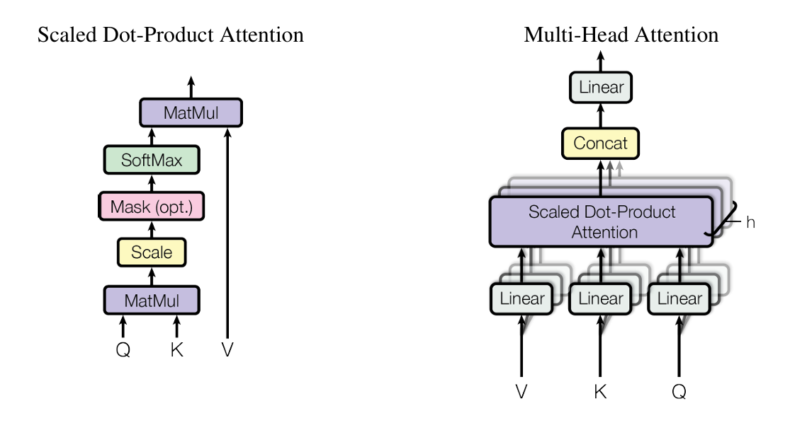
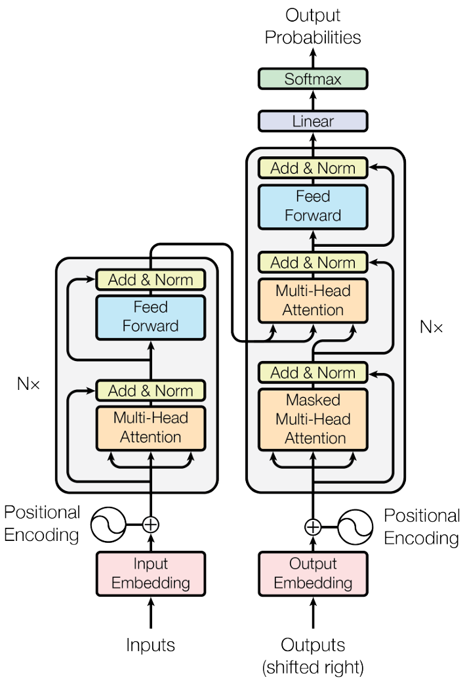

# Embedding可视化网址分享
词嵌入可视化检查器
https://ronxin.github.io/wevi/

词嵌入三维投影仪
https://projector.tensorflow.org/

# 计算机如何读懂你的“言外之意”？

> 前言：人类理解语言靠的是“直觉”和“经验”，而计算机只认识数字。自然语言处理（NLP）的核心挑战，首先在于如何把文字翻译成计算机能“听懂”且“理解”的数字语言，其次在于如何处理文字之间的时间顺序关系。笔者将带你重走一遍 NLP 的进化之路。

## 1. 计算机如何理解文字？（编码方式的演进）

要让计算机处理文字，第一步必须是“数字化” (Tokenization & Encoding)。在这个过程中，我们经历了三个阶段的探索。

### 1.1 简单粗暴的“数字标识法” (Integer Encoding)

最早的想法非常直观：给字典里的每个词编个号。

* 做法：比如“我”=1，“你”=2，“他”=3……“地球”=3568。
* 致命缺点：
* 引入了错误的数学关系：在数学上 2>1，但语义上“你”并不比“我”大，也不比“我”高级。
* 无语义关联：数字之间没有任何逻辑联系，计算机无法从“3568”和“1”之间学到“地球”和“我”的关系。

### 1.2 解决独立的“独热编码” (One-Hot Encoding)

为了消除数字大小带来的误解，人们提出了 One-Hot 编码。

* 原理：如果词表有 10,000 个词，我们就创建一个长度为 10,000 的向量。
* 表示"我"： `[1, 0, 0, ..., 0]`
* 表示"你"： `[0, 1, 0, ..., 0]`
* 每个词都在自己的维度上是 1，其余全为 0。
* 致命缺点：

1. 维度灾难 (Curse of Dimensionality)：如果词表有 10 万个词，每个词都是一个 10 万维的向量，极其稀疏，计算量巨大。
2. 正交导致无法衡量相关性：这是最痛的点。在空间几何中，One-Hot 向量两两正交（垂直）。
   * 计算向量积（点积）：A⋅B=0。
   * 这意味着，在计算机眼里，“苹果”和“梨”的相似度是 0，“苹果”和“汽车”的相似度也是 0。它根本不知道“苹果”和“梨”其实是亲戚。

### 1.3 进化的“词嵌入” (Word Embedding)

这是 NLP 领域的一个里程碑。我们不再人为规定 0 和 1，而是让神经网络自己去“训练”出一个稠密向量 (Dense Vector)。

* 核心优势：
* 降维：不需要 10 万维，通常 300 维或 512 维就够了。
* 特征提取 (Feature Extraction)：向量中的每个数字都代表一种“潜在特征”。虽然人类看不懂某个维度具体代表什么（比如可能是“是否由生命”、“是否是食物”），但计算机能懂。
* 语义相关性 (Semantic Similarity)：这是词嵌入的灵魂！
* 潜空间 (Latent Space) 与 向量运算： 词嵌入将词映射到了一个高维的几何空间（潜空间）。在这个空间里，含义相近的词，距离会更近。 我们可以使用余弦相似度 (Cosine Similarity)或点积来衡量它们的距离。

> 经典案例： 在训练好的词向量空间中，如果你做向量减法和加法，会发现神奇的数学规律：
>
> $v(\text{King}) - v(\text{Man}) + v(\text{Woman}) \approx v(\text{Queen})$

> $v(\text{Table}) - v(\text{Chair}) \approx v(\text{Mouse}) - v(\text{Keyboard})$
>
> 这说明机器真的“懂”了词与词之间的逻辑关系！

## 2. 从词向量到神经网络的挑战

好了，现在我们每个词都有了很好的向量表示（比如 300 维），那能不能直接把一句话的所有词拼起来，扔进传统的全连接神经网络（DNN）里去训练呢？

### 2.1 经典神经网络的局限

不行！这里有两个巨大的拦路虎：

1. 输入长度不固定：传统神经网络要求输入层 (Input Layer) 的神经元数量是固定的（比如 1000 个）。但人类说话时长时短，一句话可能有 5 个词，也可能有 50 个词。机器不知道该预留多少个接口。
2. 丢失位置信息（词序）：

* 类比图像识别：处理图片时，像素点是固定的（比如 30×30），我们可以把它展开成一长串输入。
* 语言的区别：如果你把一句话简单地“平铺”展开输入，计算机会像看那张被展开的像素图一样，虽然能看到所有“像素”（词），但彻底丢失了结构。
* 在语言中，“我吃鱼”和“鱼吃我”，词向量完全一样，但顺序不同，意思天差地别。传统网络很难捕捉这种先后顺序 (Sequential Information)。

## 3. 循环神经网络 (RNN) 的诞生

为了解决“变长输入”和“词序”问题，循环神经网络 (Recurrent Neural Network, RNN) 诞生了。

### 3.1 核心思想：记忆的传递

RNN 的设计灵感来源于人类的阅读习惯：我们在看当前这个词的时候，脑子里还留着上文的记忆。

RNN 引入了两个关键概念：

1. 时间步 (Time Step)：把一句话切分成 $x^{\langle 1 \rangle}, x^{\langle 2 \rangle}, \dots, x^{\langle t \rangle}$，按顺序一个一个喂给网络，而不是一口气全塞进去。
2. 隐藏状态 (Hidden State, $h$)：这就是 RNN 的“记忆体”。它负责把上一个时间步的信息，传递 (Pass) 给下一个时间步。

### 3.2 工作流程

想象一个流水线工人（RNN 单元）：

1. 他先拿到了第一个词 $x^{\langle 1 \rangle}$，处理完产生了一个记忆 $h^{\langle 1 \rangle}$。
2. 处理第二个词 $x^{\langle 2 \rangle}$ 时，他不仅看这个词，还参考了手中的记忆 $h^{\langle 1 \rangle}$，结合两者，生成了新的记忆 $h^{\langle 2 \rangle}$。
3. ...以此类推，处理到最后一个词时，手中的记忆实际上包含了整句话的信息。

## 4. RNN 的数学原理 (核心部分)

让我们用严谨的数学语言来描述这个过程。请注意，RNN 最神奇的地方在于权重共享 (Shared Weights)，即在所有时间步中，处理数据的矩阵 W 都是同一个。

### 4.1 符号定义

* $x^{\langle t \rangle}$：第 $t$ 个时间步的输入词向量。
* $h^{\langle t-1 \rangle}$：上一个时间步传过来的隐藏状态（记忆）。
* $h^{\langle t \rangle}$：当前时间步计算出的新隐藏状态。
* $y^{\langle t \rangle}$：当前时间步的输出（例如预测情感或下一个词）。

### 4.2 核心公式

RNN 单元在每个时刻主要做两件事：更新记忆和计算输出。

#### 1. 更新隐藏状态 (Calculating Hidden State)

这是 RNN 的核心，融合“旧记忆”和“新输入”：

$$
h^{\langle t \rangle} = \tanh(W_{hh} h^{\langle t-1 \rangle} + W_{xh} x^{\langle t \rangle} + b_h)
$$

其中：

* $W_{xh}$ (Input-to-Hidden)：这个矩阵负责处理当前输入 $x^{\langle t \rangle}$。它决定了当前的词有多少信息需要被写入记忆。
* $W_{hh}$ (Hidden-to-Hidden)：这个矩阵负责处理旧记忆 $h^{\langle t-1 \rangle}$。它决定了我们要保留多少过去的记忆。
* $b_h$：偏置项 (Bias)，用于调整激活阈值。
* $\tanh$：非线性激活函数，将值压缩在 $(-1, 1)$ 之间，防止数值在不断循环中爆炸。

> 维度还原（参考视频）： 假设词向量 $x^{\langle t \rangle}$ 是 300 维，隐藏状态 $h$ 设定为 100 维。
>
> * $x^{\langle t \rangle}$ 是 $(300, 1)$
> * $h^{\langle t-1 \rangle}$ 是 $(100, 1)$
> * 为了能相加，矩阵 $W_{xh}$ 必须是 $(100, 300)$，矩阵 $W_{hh}$ 必须是 $(100, 100)$。
> * 最终 $h^{\langle t \rangle}$ 保持 $(100, 1)$。

#### 2. 计算输出 (Calculating Output)

根据当前的记忆，给出结果：

$$
y^{\langle t \rangle} = \text{Softmax}(W_{hy} h^{\langle t \rangle} + b_y)
$$

矩阵推导解析：

* $W_{hy}$ (Hidden-to-Output)：将当前的隐藏状态 $h^{\langle t \rangle}$ 映射到输出空间。
* 如果我们要预测情感（正面/负面），这里可能接一个 Sigmoid；如果是预测下一个单词（词表大小 10000），这里接 Softmax，输出一个 10000 维的概率分布。

## 5. RNN 的局限与展望

虽然 RNN 解决了变长序列和词序问题，但它并不完美，视频最后也点出了它的两个死穴：

1. 长期依赖问题 (Long-Term Dependencies)：

* 随着时间步 $t$ 的增加，最早期的 $x^{\langle 1 \rangle}$ 的信息在经过多次矩阵乘法和 $\tanh$ 压缩后，信号会变得极其微弱（梯度消失），导致网络“记不住”开头说的话。
* 比如："我出生在中国......（中间过了500个字）......所以我说流利的中文。" RNN 很难把最后的“中文”和开头的“中国”联系起来。

1. 无法并行计算 (No Parallelization)：

* RNN 是个严重的“串行”过程。必须先算出 h1 才能算 h2。这意味着它无法利用 GPU 强大的并行计算能力，训练速度非常慢。

### 展望

为了解决这些问题，后来诞生了 LSTM (长短期记忆网络) 和 GRU，它们通过引入复杂的“门控机制”来缓解遗忘问题。

但真正彻底颠覆 NLP 领域，解决了并行计算并能捕捉无限长距离依赖的，是视频片尾那个霸气的背影 —— Transformer (Attention Mechanism)。那是另一个更宏大的故事了。

# Transformer：推倒“循环”的高墙，开启“上帝视角”

> 前言：我们见证了 RNN 如何通过“记忆传递”解决了变长输入的问题。但 RNN 有两个致命的弱点：慢（无法并行计算）和忘（长距离依赖丢失）。
>
> 2017年，Google 团队发表了一篇名为 *Attention Is All You Need* 的神级论文，提出了 Transformer 架构。它不再像 RNN 那样“读一个词，记一个词”，而是一口气看到整句话。从此，NLP 进入了 LLM（大语言模型）的爆发前夜。

## 1. 引言：推翻旧秩序 (From RNN to Transformer)

### 1.1 RNN 的“流水线”痛点

回想一下 RNN 的工作模式：它是一个串行的过程。

* 计算 $h_t$ 必须等待 $h_{t-1}$。这意味着，只要上一个词没处理完，下一个词就得等着。
* 这导致了它无法利用 GPU 强大的并行计算能力，训练效率极低。
* 同时，随着句子变长，开头的信息在经过几十次传递后，信号微弱得几乎消失（梯度消失问题）。

### 1.2 Transformer 的颠覆性思想

* 并行计算 (Parallelization)：它不再按顺序输入，而是把整句话（比如“我爱你宝贝”）作为一个整体矩阵，一次性扔给神经网络。
* 全局视野 (Global View)：在这个架构里，句首的“我”和句尾的“宝贝”之间的距离是 0。它们可以直接通过矩阵运算产生联系，彻底解决了“长距离依赖”的问题。

## 2. 位置编码 (Positional Encoding)：找回丢失的顺序

### 2.1 既然并行，怎么分前后？

如果你把“我爱你是真的”和“是真的我爱你”扔给一个没有时间概念的网络，它看到的词向量集合是完全一样的（Bag of Words）。因为我们抛弃了 RNN 的时序结构，计算机就不知道谁排在第一位了。

### 2.2 解决方案：给词向量“打标签”

为了解决这个问题，Transformer 引入了位置编码 (Positional Encoding, PE)。

* 核心操作：不是简单的把位置信息拼接（Concat）在词向量后面，而是直接相加 (Add)。
* 公式表示：
  $$
  \text{Input} = \text{Word Embedding} + \text{Positional Encoding}
  $$
* 物理含义：原来的词向量只包含“语义”（比如“苹果”是吃的），加上位置编码后，这个向量就变成了“出现在第3个位置的苹果”。

## 3. 核心引擎：自注意力机制 (Self-Attention)

这是 Transformer 最迷人、也是最核心的部分。

### 3.1 什么是 Q, K, V？

为了计算词与词之间的关系，Transformer 把每个词向量通过线性变换，分裂成了三个新的向量：Query (Q)，Key (K)，Value (V)。

我们可以用“图书馆检索系统”来类比这三个矩阵：

* Query (Q - 查询)：我想查什么？（比如手里拿着一张借书条，上面写着“我要找关于AI的书”）。
* Key (K - 索引)：书架上的标签符合吗？（每本书脊上都有标签，如“烹饪”、“计算机”、“小说”）。
* Value (V - 内容)：如果符合，我要取出的内容是什么？（书里的实际内容）。

### 3.2 数学推导 (Step-by-Step)

自注意力机制的本质，就是让每个词去和句子里的所有词（包括它自己）“对暗号”，看看关系有多铁。

核心公式：

$$
\text{Attention}(Q, K, V) = \text{softmax}\left(\frac{QK^T}{\sqrt{d_k}}\right)V
$$

**我们来拆解这个公式的每一步物理意义**：

#### **第一步：计算相关性 ($QK^T$)**

$$
\text{Score} = Q \times K^T
$$

**我们拿着当前词的 $Q$（查询），去和所有词的 $K$（索引）做点积 (Dot Product)**。

* **几何意义**：点积代表两个向量的相似度。结果越大，说明两个词的关系越紧密（注意力分数越高）。
* *例子*：在处理“我**爱**你”时，“爱”的 $Q$ 和“你”的 $K$ 点积会很高，说明“爱”要把很多注意力放在“你”身上。

#### **第二步：缩放 ($\frac{1}{\sqrt{d_k}}$)**

* **为什么要除以 $\sqrt{d_k}$（向量维度的根号）？**
* **防止梯度消失**：如果点积结果太大，Softmax 函数会进入“饱和区”（梯度趋近于0），导致无法训练。这一步是为了让数值保持在合理的范围内。

#### **第三步：归一化 (Softmax)**

$$
\text{Probability} = \text{softmax}(\text{Score})
$$

**将上面的分数转换成概率分布（所有分数加起来等于 1）**。

* **这代表了“关注度权重”。比如对于“爱”这个词，它可能分配了 0.1 给“我”，0.8 给“你”，0.1 给“自己”。**

#### **第四步：加权求和 ($\dots \times V$)**

$$
\text{Output} = \sum (\text{Probability} \times V)
$$

**最后，用计算出的权重，去抽取所有词的 $V$（内容）**。

* **结果**：如果“你”的权重很高，那么最终生成的向量里，就包含了大量“你”的信息。
* **意义**：经过这一步，每个词都吸收了整句话的上下文信息，变成了 **Contextual Embedding（上下文相关的词向量）**。
* **解决多义词 (Polysemy)**：这完美解决了“一词多义”的问题。比如单词 **"Bank"**，在 "Bank of China"（银行）和 "River Bank"（河岸）中，虽然原始词向量一样，但经过 Attention 吸收上下文后，前者会吸收“China”、“Money”的信息，后者会吸收“River”、“Water”的信息，从而在数学上变成了两个完全不同的向量。

## 4. 多头注意力 (Multi-Head Attention)：多维度的视角

### 4.1 为什么要搞“多个头”？

**如果只有一个 Attention 矩阵，可能只能捕捉到一种关系（比如语法关系）。但语言是复杂的。**

 **类比** **：就像我们在阅读一篇文章时，大脑的不同区域在同时工作：**

* **Head 1（语法头）** **：关注“主谓宾”结构，关注“爱”后面接的是名词。**
* **Head 2（指代头）** **：关注“它”指代的是前文的哪个人。**
* **Head 3（情感头）** **：关注这句话是褒义还是贬义。**

### 4.2 实现方式

* **将原本巨大的** **Q**,**K**,**V** **矩阵切分成** **h** **个小矩阵（Head）。**
* **每个 Head 独立进行 Self-Attention 计算（并行进行，互不干扰）。**
* **最后将所有 Head 的输出** **拼接 (Concat)** **回去，再通过一个线性层融合信息。**

## 5. Transformer 的整体架构 (Encoder-Decoder)

**Transformer 的完整图景，它主要由两部分组成：**

### 5.1 架构流

1. **输入 (Input)** **→** **位置编码 (PE)**
2. **多头注意力 (Multi-Head Attention)** **：捕捉全局依赖。**
3. **残差连接与归一化 (Add & Norm)** **：**

* **Add (Residual Connection)**：$x + \text{SubLayer}(x)$。这是一条“信息高速公路”，防止网络层数过深导致原始信息丢失（退化）。
* **Norm (Layer Normalization)**：让数据分布更稳定，加速训练。

4. **前馈神经网络 (Feed Forward)** **：知识的“数据库”。**

   * 如果说 Attention 是在词之间传递信息，那么 FFN 则负责**存储事实性知识**。
   * 研究表明，FFN 层充当了**键值对记忆 (Key-Value Memory)** 的角色。例如，当输入“波兰”时，FFN 层会通过模式匹配和向量运算，将其映射到“华沙”。它存储了模型从海量训练数据中学到的百科全书式的知识。
5. **输出** **。**

### 5.2 编码器与解码器

* **Encoder（左边）** **：负责“理解”。把输入的自然语言转换成深层的语义向量。**
* **Decoder（右边）** **：负责“生成”。根据 Encoder 给出的语义向量，一个字一个字地预测输出（比如翻译任务）。**

## 6. 总结与展望

**Transformer 的出现，是 NLP 历史上的“工业革命”。**

1. **里程碑意义** **：它证明了我们不需要循环（RNN）也不需要卷积（CNN），仅仅凭借****注意力机制 (Attention)** **就能完美地建模语言。**
2. **基石地位** **：**

* **BERT** **(Bi-directional Encoder Representations from Transformers) 使用了 Transformer 的** **Encoder** **部分，学会了极致的“理解”。**
* **GPT** **(Generative Pre-trained Transformer) 使用了 Transformer 的** **Decoder** **部分，学会了极致的“生成”。**

## 7. 大语言模型的训练与“涌现” (Training & Emergence)

**了解了架构之后，你可能会问：这些模型是如何变得如此聪明的？**

### 7.1 训练的本质：预测下一个词 (Next Token Prediction)

**与传统的监督学习（需要人工标注“猫”、“狗”标签）不同，LLM 的训练方式非常“朴素”：自监督学习。**

* **核心任务**：给模型看半句话，让它猜下一个词是什么。
  * *例子*：“我喜欢在咖啡里加奶油和____”。模型需要预测“糖”。
* **海量数据**：GPT-3 是在约 **5000 亿** 个词的语料库上训练的。相比之下，一个 10 岁的人类儿童大约只接触过 1 亿个词。
* **训练过程**：一开始模型是瞎猜的。但经过数千亿次的“猜测-对比-修正”（反向传播），它逐渐掌握了语言的规律，甚至世界的知识。

### 7.2 规模带来的奇迹：涌现 (Emergence)

**当模型参数量和训练数据量突破某个临界点时，模型突然展现出了设计者未曾预料到的能力，这就是“涌现”。**

1. **心智理论 (Theory of Mind)**：

   * **测试**：Sam 把巧克力放进袋子离开了。你可以把巧克力换成爆米花。Sam 回来后会觉得袋子里是什么？
   * **结果**：GPT-4 能像人类一样推断出 Sam 仍然认为袋子里是巧克力（尽管它是错的）。这说明模型具备了理解他人心理状态的能力。
2. **跨模态推理**：

   * **案例**：GPT-4 虽然只看过文本代码，没看过图，但它能用 TiKZ 编程语言画出一只独角兽。更神奇的是，如果你让它“去掉角”，它能准确地修改代码对应的部分。这说明它真的“理解”了独角兽的结构，而不仅仅是死记硬背。

## 8. 控制模型的“创造力”：解码参数 (Decoding Parameters)

**当模型训练好后，我们在使用它（调用 API）时，可以通过调整几个关键参数来控制它“怎么说话”。这决定了它是像个严谨的科学家，还是像个天马行空的诗人。**

### 8.1 温度 (Temperature)

* **定义**：控制概率分布的“平滑”程度。
* **原理**：
  * **低温度 (< 1.0)**：拉大高概率和低概率词之间的差距。模型会变得**保守**，总是选择概率最高的词。
  * **高温度 (> 1.0)**：缩小差距，让低概率的词也有机会被选中。模型会变得**随机、有创造力**，但也更容易胡说八道。
* **如何选择**：
  * **0 - 0.3**：代码生成、数学解题、事实性问答（需要精准、稳定）。
  * **0.7 - 1.0**：日常对话、创意写作、头脑风暴（需要多样性）。

### 8.2 Top-k 采样

* **定义**：在每一步生成时，只保留概率最高的 **k** 个词，其他的全部剔除。
* **作用**：切断了那些概率极低、完全不靠谱的词（比如“我喜欢吃”后面接“汽车”）。
* **如何选择**：通常设置为 **40 - 50**。这是一种比较硬的截断方式。

### 8.3 核采样 (Top-p / Nucleus Sampling)

* **定义**：比 Top-k 更智能。它不看数量，看**累积概率**。它会选取概率加起来达到 **p**（比如 0.9）的那一小撮词。
* **优势**：
  * 如果下一个词很确定（比如“人工智_” -> “能”），可能 Top-p 只包含 1 个词。
  * 如果下一个词很不确定（比如“今天天气_”），Top-p 可能包含 20 个词。
  * 它能根据上下文的确定性动态调整候选池的大小。
* **如何选择**：通常设置为 **0.9** 或 **0.95**。

> **最佳实践**：通常建议 **Top-p 和 Temperature 配合使用**，或者二选一调整。不要同时把它们调得极端。

**从 RNN 到 Transformer，我们终于让计算机从“管中窥豹”，进化到了“一览众山小”。现在，计算机不仅能读懂你的字面意思，更能通过全局注意力，精准捕捉你藏在字里行间的“言外之意”。**
